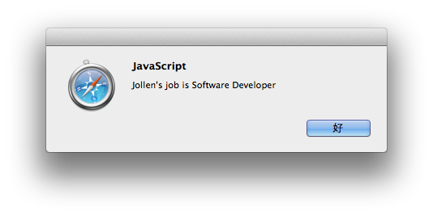

## 1.2 宣告 Class

同樣地，JavaScript 沒有類似 Class 這樣的語法，所以要宣告 Class 的話，以 function 關鍵字來實作即可，等價於函數宣告：

~~~~~~~~
function Person(name, job) {
	this.name = name;
	this.job = job;
	this.queryJob = function() {
		alert(this.job);
	};
}
~~~~~~~~

將 Function 關鍵字做為 Class 的宣告，自然就要討論是否能以 new 關鍵字將 Class 實例化成物件。在 JavaScript 裡，可以支援這樣的寫法。
以下是一個實例化（Instantiate）的例子：

~~~~~~~~
<!doctype html>
<html lang="en">
<head>
    <meta charset="UTF-8">
    <title>MokoCrush</title>
</head>

<body>

</body>
</html>
~~~~~~~~

在這個例子裡，person 是 Person class 的實例化。所以，調用 person.queryJob() 方法時，所看到的畫面如下：

JavaScript 裡生成物件的做法：

- 使用 var 關鍵字宣告物件
- Instantiable Function

| [1.1](1-object.md) | 1.2 宣告 Class |
