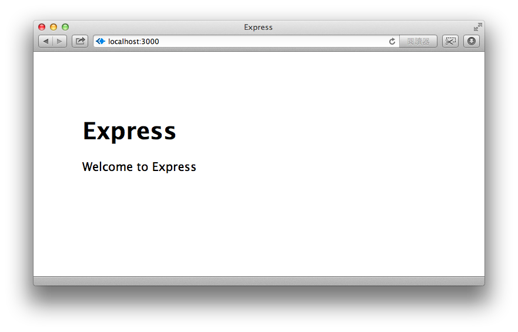

# 8.1 Express.js 初體驗

經過前幾章的基礎學習後，接下來開始進入 Node.js 的進階主題。首要課題就是導入一個 Web Application Framework，以協助開發者發展 Web Application。現在，我們需要一個 Web Application Framework，來簡化 URL Routing 的開發，一個很好的選擇是 Express.js。

Express.js 除了支援 URL Routing 的功能外，也提供很完整的 Web Application 支援。Express.js 的功能強大，對 Express.js 的初學者來說，要先學好以下 3 個主題：

- 使用 Express.js 做 URL Routing
- Express.js 與 HTML Template 的結合
- 學習 Jade Programming Language

本章的範例可由 Github 取得：

~~~~~~~~
http://github.com/jollen/nodejs-express
~~~~~~~~

接下來，透過一個連貫性的實例，學習 Express.js、HTML Template 與 Jade 程式語言。

### Step 1：安裝 Express application generator

NoChat 是第 3 章與第 4 章的實例，包含 Server 端與 Client 端。Client 端是一份 HTML5 網頁，這份網頁應該要放到 Web Server 上存取。典型的 Web Server 是 Apache 軟體，所以可以使用 Apache 來架構自已的 Web Server，以便瀏覽 Client 端網頁。

另外一個做法，是使用 Node.js 的 Web Server 功能，將網頁放到 Node.js 的 Web Server 裡。這個功能如果使用 Express.js 來做的話，只需要幾個步驟即可完成。

利用 npm 安裝 Express 的 application generator：

~~~~~~~~
$ npm install express-generator -g
~~~~~~~~

你可以利用 ```express -h``` 命令來查詢更多 Express application generator 的用法。

### Step 2：建立 Express.js 專案

先建立一個新的專案目錄，在這個目錄下，使用 npm 安裝 Express.js：

~~~~~~~~
$ express myapp
~~~~~~~~

安裝完成後，執行 Express.js 命令列工具：

~~~~~~~~
$ express .

   create : myapp
   create : myapp/package.json
   create : myapp/app.js
   create : myapp/public
   create : myapp/public/javascripts
   create : myapp/public/stylesheets
   create : myapp/public/stylesheets/style.css
   create : myapp/public/images
   create : myapp/routes
   create : myapp/routes/index.js
   create : myapp/routes/users.js
   create : myapp/views
   create : myapp/views/index.jade
   create : myapp/views/layout.jade
   create : myapp/views/error.jade
   create : myapp/bin
   create : myapp/bin/www

   install dependencies:
     $ cd myapp && npm install

   run the app:
     $ DEBUG=myapp:* npm start
~~~~~~~~

在執行 ```app.js``` 主程式前，需要安裝 Express 所需的相依模組：

~~~~~~~~
$ cd myapp
$ npm install
~~~~~~~~

接著執行 Express 的主程式：

~~~~~~~~
$ npm start
~~~~~~~~

Express application generator 自動幫我們生成了 Node.js 的專案架構，```app.js``` 是主要的 Web Application 主程式，開發人員只要基於 app.js 來做擴充即可。利用瀏覽器開啟 *http://localhost:3000/* 網址，可以看到圖 8-1 的畫面，表示一個基本的 Web Appication Framework 已經順利啟動了。



Express.js 是一個 Web Application Framework，也可以很方便地協助我們發展 Web Service API。基本上，Express.js 並不是一個 Web Server 的模組，因此不要誤解 Express.js 只是一個輕量級的 Web Server；Express.js 的本質是一個 Web Application 開發框架。

此外，要學好 Express.js，就要了解它的基本精神。Express.js 的基本精神，是提供了一個基於 URL Routing 機制的應用程式框架。此外，基於 Express.js 所發展的 Web 應用程式，會以 API 的形式呈現出來。這裡所指的 API 可以是典型的 URL（CGI）形式，也可以是 REST 的標準。

總結來看，Express.js 並不只是一個提供網頁服務的 Web Server，即使這也是 Express.js 其中一個功能。

### Step 3：認識 Express 專案結構與 MVC 模式

以下是 Express 所生成的專案結構（Structure）：

- *app.js*：Web Application 原型
- *package.json*：NPM 套件管理程式設定檔
- *public/*：放置靜態文件
- *routes/*：處理 URL Routing 的程式碼
- *views/*：放置 View 文件

關於 View 文件的觀念，在後續討論 MVC 設計模式時再做說明。目前，有一個很簡單的問題：圖 8-1 的主畫面存放在什麼位置？從典型的「網頁製作」觀念來看的話，應該會有一份 *index.html* 的文件，並且可能放置在 *public/* 目錄下。

然而，圖 8-1 的主畫面，實際上是由 *views/index.jade* 所動態產生。與網頁製作的概念比較，可以整理出幾個很基本但相當重要的觀念：

- *index.html* 是一種製作文件（Web Pages）的觀念，這是一個開發網站的概念
- *index.jade* 是一個 HTML5 模板（HTML5 Template），製作模板的語法稱為 Jade
- *index.jade* 是製作應用程式（Web Apps）的觀念，應用程式的 Presentation 與程式碼要切割開來
- Presentation 的部份以 Jade 撰寫，並存儲在 views/ 目錄下
- 程式碼的部份，以 JavaScript 撰寫，這是一個靜態文件，所以應儲存於 *public/javascripts/* 目錄下
- 也就是說，這個 Web App 的架構採用 MVC 設計模式

Express 框架把基本的 MVC 模式都做好了。簡單來說，利用 Node.js + Express 可以很輕地開發 Web Application，這個 Web Application 的基本能力是提供 Web Service API。

### Step 4：佈署靜態文件

Express 生成的專案結構，規劃了一個存放靜態文件的目錄，常見的靜態文件有 CSS、JavaScript 與圖片等等。要將 Express 當做典型的 Web Server 來使用時，只要將靜態文件放置於 *public/* 目錄下即可。例如，要佈署 Bootstrap 至目前的 Express.js 專案，做法如下：

~~~~~~~~
$ cd myapp                (切換到專案目錄)
$ cd public               (進入 public/ 目錄)
$ cd stylesheets          (Express.js 所規劃用來存放 CSS 的目錄)
~~~~~~~~

接著將 Bootstrap 的 CSS 下載至這個目錄下：

~~~~~~~~
$ wget http://netdna.bootstrapcdn.com/bootstrap/3.0.1/css/bootstrap.min.css
~~~~~~~~

同理，將 JavaScript 程式碼下載至對應的目錄下：

~~~~~~~~
$ cd ../javascripts/
$ wget http://netdna.bootstrapcdn.com/bootstrap/3.0.1/js/bootstrap.min.js
~~~~~~~~

可以利用 *tree* 命令，來檢查目前為止的 *public/* 狀態：

~~~~~~~~
├── public
│   ├── images
│   ├── javascripts
│   │   └── bootstrap.min.js
│   └── stylesheets
│       ├── bootstrap.min.css
│       └── style.css
~~~~~~~~

*style.css* 是 Express.js 自動產生的檔案。到這裡，經由以上 4 個學習步驟，我們可以知道如何將 NoChat 範例佈署至 Express.js 專案裡，並透過 Express.js 來提供網頁的服務。這部份留給讀者自行練習。

### Step 5：擴充 app.js

*app.js* 是 Express 生成的 Web Applicatoin Framework。開發人員將基於 *app.js* 擴充這個 Web Application Framework 的功能：

- 擴充 URL Routing
- 實作與定義 REST API
- 加入 Middleware
- 使用 HTML Template 撰寫 UI

關於以上 4 個主要的 Express 技術，後續將以獨立的章節進行說明。這是開發 Express.js 的重點戲，對初學者來說，必須先學習 URL Routing 的開發。關於 URL Routing 的觀念，已經在第 3 章做過說明。

## Express.js 的學習建議

以下是建議的 Express.js 學習步驟，初學者可依照這個順序進行練習。在熟悉每一個步驟後，再繼續研讀更多主題。

- Stage 1：學會建立新的 Express.js 專案
- Stage 2：了解 Express.js 專案的目錄結構
- Stage 3：練習加入 Bootstrap
- Stage 4：學習 Jade 語法並撰寫第一個 "View"
- Stage 5：練習新增 URL Routing

截至目前為止，我們已經學會了 Stage 1~3 的做法，接下來繼續說明 Stage 4 與 Stage 5 的做法與觀念。

---

Next: [8.2 MVC 與 HTML Template Engine](2-template.md)
