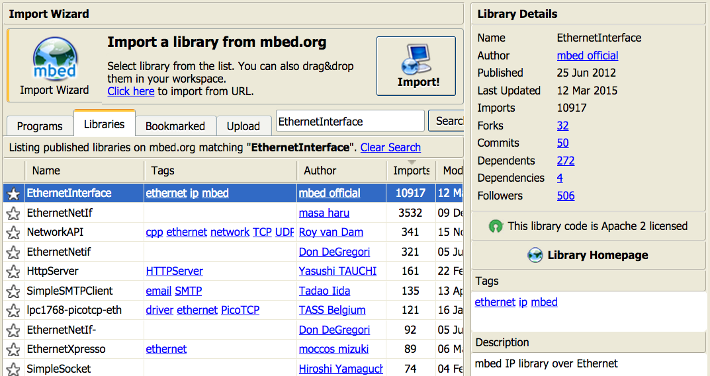
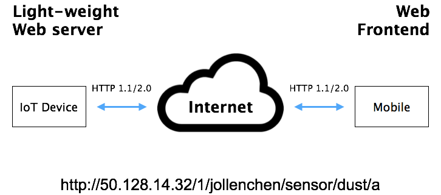

# ARM mbed 物聯網裝置入門 - Networking

本章是一個重要的里程碑，在學習 Node.js 與 Backbone.js 後，將開始進入 IoT 的學習階段。根據第 14 章所說明的 Web of Things 架構，在 WoT 觀念裡的物聯網系統，包含四大部份：

1. IoT Device
2. IoT Proxy
3. IoT Server
4. Mobile 與 Client

這是現代 WoT 系統的基礎建設，從實體（硬體）的角度來看，需要設計與製造這四類型的產品。如果從通訊協定的角度來看，WoT 入門要學習三種協定的實作：

1. HTTP 1.1 / 2.0
2. Websocket
3. CoAP

協定的學習，重點在它們的 Use Case 設計上，而不是「通訊協定程式庫」的實作。實際上，如果使用 ARM mbed 做為 IoT Device 的技術，mbed 作業系統本身，就提供這三種通訊協定的程式庫。同樣地，以 Node.js 做為開發環境的話，都能找到相關的 npm 模組。

IoT Device 部份，本書選擇以 ARM mbed 作業系統做為開發技術。

## ARM mbed 作業系統

本書將以 ARM mbed 作業系統，以及 Arch Pro 開發板，來介紹 WoT 裝置的實作。

mbed 是 ARM Ltd 所推出的物聯網作業系統。ARM mbed 並不只是一個作業系統核心（OS kernel），從 ARM mbed 的生態來看，它包含三個部份：

1. mbed OS
2. mbed Device Server
3. mbed Tools

分別說明如下。

### mbed OS

ARM mbed 的定位是 Full Stack 的物聯網作業系統，它的底層是一個 RTOS （real-time operating system）作業系統核心。mbed RTOS 本身提供以下機制：

* Thread
* Mutex
* Semaphore
* Message Queue
* Mail
* Memory Poll

ARM mbed 是專門針對物聯網所設計的作業系統，它是「另一個作業系統」，還是真正的 IoT 作業系統。可以從以下幾個 mbed 特色來觀察：

1. ARM mbed 是特別為 ARM Cortext-M MCU 重新設計的作業系統，這點幾乎可以完全說明 ARM mbed 與其它作業系統的不同

2. 未來的物聯網裝置硬體架構，會有很大的比率會以 MCU 做為主要架構，而不是以 AP（Application Processor）做為主要架構，ARM mbed 作業系統的設計正能符合這個趨勢

3. WoT 裝置需要 HTTP、Websocket 與 CoAP 等基本的 Web 協定，甚致需要更多不同的通訊協定技術，因此 ARM mbed 也提供官方與第三方（Community）的程式庫，這讓 ARM mbed 裝置可以很容易實作 WoT 與 Physical Web 的觀念

4. ARM mbed 作業系統d核心，上面堆疊這些豐富的程式庫後，就成為一個不折不扣，有完整軟體程式庫堆疊（Full Stack）的作業系統

從上述的分析，也可以說明 Arduino 與 ARM mbed 的差異。Arduino-style 的硬體，沒有專用的作業系統，應用上（Use Case）比較偏向 GPIO 控制。ARM mbed style 的硬體，有專用的 Full Stack 作業系統，有完整的 Web 相關通訊程式庫。

當然，我們也可以在 Arduino 裝置裡實作 HTTP；同理，也可以將 ARM mbed 使用在 GPIO 控制的案例裡。但以軟體計哲學的角度來看，二者的差異還是很清楚的。

這就是本書選擇 ARM mbed 來實作 WoT 的原因，也因為 ARM mbed 是走向 Web of Things 的設計哲學，因此書上並不會介紹 ARM mbed 的 Arduino-style 實作（GPIO 控制）。對這部份有興趣的讀者，可以參考 mbed Taiwan 所編寫的一份教材：

```
https://www.mokoversity.com/workshop/mbed-school
```

另外，因為節省時間，本書將使用由深圳 Seeed Studio 所設計與生產的 Arch Pro 開發板。Arch Pro 是 ARM mbed 專用的開發板，內建 Ethernet、USB Host/Device 與 Grove connectors，還有與 Arduino 相容的 form factor。Arch Pro 會比 LPC1768 開發板更為方便，因為搭配 Grove Starter Kit for mbed 感測器模組套件，就可以 DIY 出各種 IoT 硬體裝置。可以節省接杜邦線與插電路板的時間。

本章將以 ARM mbed 來實作 REST Device（Representational State Transfer device）的觀念。這部份可以參考筆者的文章：

[1]: http://www.jollen.org/blog/2015/01/arm-mbed-1-physical-web.html

總結來說，ARM mbed 的開發板並不是「另一個 Arduino」硬體，而是更能符合 WoT 理念的 RESTful Device 作業系統。同樣的硬體，不同的觀念、技術框架與商業思維，能帶來不同的產品思維與商業模式。所以，或許 ARM mbed 與 WoT 帶來的是一場新的革命與機會。

### mbed Device Server

Analogous to a Web Server that accepts connections from mobile phones or web browsers, a Device Server handles the connections from IoT devices.

### ARM mbed Tools

ARM mbed 使用 online compiler 開發環境，原則上只要使用瀏覽器即可立即開發。不過 mbed 也能支援 GCC 或 Eclipse 的離線開發環境，這部份可參考 mbed 官方網站上的說明：

http://developer.mbed.org/cookbook/Using-mbed-with-gcc-and-eclipse

ARM mbed 的 online compiler 具備 Git 版本管理的功能，還能線上匯入外部程式庫（Class Libraries），還可以分享自己的程式碼。首次接觸 ARM mbed 的開發者，仍建議先以 online compiler 為主。以下說明 ARM mbed 的 online compiler 使用方式。

將 Arch Pro 與電腦連接後，至 mbed.org 申請一個開發者帳號後，進入 online compiler 的 Workspace 環境，如圖 15.1。


圖 15.1：mbed 的 Workspace

依照以下步驟建立第一個 "Hello, World"：

1. 在 workspace 裡點選 *New -> New Program*
2. *Platform* 選取 mbed LPC1786
3. *Template* 選取 Blinky LED Hello World
4. *Program Name* 填寫自訂名稱
5. 按 *OK*

Arch Pro 與 LPC1768 開發板相容，因此步驟 2 請選取 mbed LPC1786。


圖 15.2：New Program

mbed 提供許多 Program 與 Library 範本，這裡使用的是一個 LED（發光二極體，Light-Emitting Diode）閃爍的程式碼範本。接著進行編譯與 firmware 更新：

1. 在 workspace 裡點選 *Compile -> Compile All*
2. 編譯成功後，會自動下載一個副檔名為 *.bin* 的 firmware
3. 將下載回來的 firmware 拷貝到 Arch Pro 開發板

使用 Mac 環境的開發者，使用 USB 線將 Arch Pro 連接到電腦後，會看到 *MBED/* 資料夾，再將下載回來 firmware 檔案拉到此資料夾裡即可，如圖 15.3。

4. 拔除並重接 USB 線，讓 Arch Pro 重新關機。
5. 完成。可以看到 Arch Pro 的 LED1 開始閃爍。


圖 15.3：Drag and Drop 更新 firmware

Arch Pro 開發板有大量的 GPIO，可外接各種感測裝置，這部份請參考 mbed Taiwan 所編寫的教材。學會使用 mbed 的 online compiler 後，可以使用一個基本的 GPIO 控制程式當做「Hello World」。以下是一個控制 Arch Pro LED 燈號的範例：

```
#include "mbed.h"

DigitalOut myled1(LED1);
DigitalOut myled2(LED2);
DigitalOut myled3(LED3);
DigitalOut myled4(LED4);

unsigned int mask = 0x1;

int main() {
    wait(0.8);
    
    while(1) {    
        myled1 = mask & 0x1;
        myled2 = mask & 0x2;
        myled3 = mask & 0x4;
        myled4 = mask & 0x8;
        
        wait(0.2);
        
        mask = mask << 1;
        
        if (mask & 0x10) 
            mask = 0x1;
    }
}
```

本範例程式已發佈在 mbed.org 上：

```
http://developer.mbed.org/users/mbedschool/code/mbed_led_run/
```

請練習使用 online compiler 的匯入功能，將本範例直接匯入使用，並安裝至 Arch Pro 開發板進行測試。

## mbed Compile API

ARM mbed 有公開的 Compile API，如果不想使用 online compiler，也不打算安裝 Offline Toolchain 的話，使用 Compile API 是一個不錯的選擇。

使用 *curl* 來呼叫 mbed Compile API：

```
$ curl https://developer.mbed.org/api/v2/tasks/compiler/start/ -X POST -d "platform=mbed-lpc1768&program=mbed_blinky" --user jollen
```

請將 *platform=* 置換為正確的 mbed 開發板型號，將 *program=* 置換為想編譯的 mbed 程式。*program=* 的程式名稱，就是 online compiler 上的程式專案名稱。

下載編譯完成的檔案：

```
$ curl https://developer.mbed.org/api/v2/tasks/compiler/sbin -X POST -d "platform=mbed-lpc1768&program=mbed_blinky" --user jollen -o mbed_blinky.bin
```

再將 *.bin 檔安裝至 mbed 開發板即可。

## mbed Networking

ARM mbed 作業系統本身具備 networking feature（例如：3G、ethernet），因此不再只是扮演傳統 GPIO 控制，或是藍芽傳輸的角色；它可以透過 Websocket 連線，將 sensor data 推送（data push）給伺服器。ARM mbed 作業系統也提供 httpd library，能在 ARM mbed 裝置上發展 REST API，並透過 HTTP 讓 client 端呼叫。

基於 ARM mbed 作業系統的 Arch Pro 開發板，如果只當做 GPIO 控制器來使用，就太可惜了。將 Arch Pro 做為 Physical Object 的觀念，才能發揮 ARM mbed 作業系統的潛能。Physical Object 等價於 REST Device 的觀念。

mbed 官方提供二個 Ethernet 有關的 Class Library：

* EthernetInterface
* WiflyInterface

EthernetInterface 支援 Cable 乙太網路連線，WiflyInterface 則是支援 WiFi 乙太網路連線。以下分別說明其用法。

### Step 1：匯入 *EthernetInterface*

首先，建立一個新的 mbed 專案，再使用 Import Wizard 匯入 mbed 官方的 *EthernetInface* Library；如圖 15.4。



圖 15.4：匯入 *EthernetInterface*

### Step 2：實例化 *EthernetInterface*

引入標頭檔：

```
#include "EthernetInterface.h"
```

然後實例化 *EthernetInterface*：

```
int main() 
{
 	...   
    // Ethernet Interface
    EthernetInterface eth;
    ...
}
```

### Step 3：設定網路組態

可以自行指定 IP 位址、Network 與 Gateway IP：

```
int main() 
{
 	...   
    // Ethernet Interface
    EthernetInterface eth;
    ...
    eth.init("192.168.2.1", "255.255.255.0", "192.168.2.254");
    eth.connect();
}
```

要改用 DHCP 的組態方式，也是非常簡單的：

```
int main() 
{
 	...   
    // Ethernet Interface
    EthernetInterface eth;
    ...
    eth.init("192.168.2.1", "255.255.255.0", "192.168.2.254");
    eth.connect();
}
```

### Step 4：測試網路連線－使用 Websocket Client

如何測試 Arch Pro 是否成功連上網路？一個最簡單的方式，就是透過 LED 燈號來指示：

```
// Ethernet Status
DigitalOut led1(LED1);

int main() 
{
    // init status
    led1 = 1;
 	...   
    // Ethernet Interface
    EthernetInterface eth;
    ...
    eth.init("192.168.2.1", "255.255.255.0", "192.168.2.254");
    eth.connect();
    led1 = 0;
}
```

如果 *eth.connect()* 成功，LED1 就會被燈亮。但是最有效且明確的方式，還是要讓 Arch Pro 試著呼叫 Web Service。在這裡使用 Mokoversity 發展的 WoT.City 進行測試。

WoT.City 提供 Websocket Broker（即 Server）服務。使用 WoT.City 的 Websocket 服務，只要透過以下的 URI 即可：


```
ws://wot.city/object/jollentemp1/send
```

請將 URI 的 *jollentemp1* 替換為自已的名稱，這個名稱代表 Arch Pro 的名字，請自行命名即可。接著以 Websocket Client 推送一段連續數據給 WoT.City。在 ARM mbed 裝置上實作 Websocket Client 的方式非常簡單，只要匯入 *Websocket* Library 即可。

完整程式碼如下：

```
#include "mbed.h"
#include "EthernetInterface.h"
#include "Websocket.h"

// Ethernet Status
DigitalOut led1(LED1);
DigitalOut led2(LED2);

int main() 
{
    char data[256];

    // Ethernet Interface
    EthernetInterface eth;

    // init status
    led1 = 1;
    led2 = 1;

    // 使用 DHCP
    eth.init();
    eth.connect();
    led1 = 0;

    // 與 WoT.City 建立 Websocket 連線
    Websocket ws("ws://wot.city/object/jollentemp1/send");

    // 不斷 Retry，直到連線成功
    while( !ws.connect() );
    led2 = 0;

    // 每隔 1 秒，推送一筆數據至 WoT.City
    while(1) {
        wait(1.0);
        
        sprintf(data , "{ \"temperature\": %f }", 25.0);
        ws.send(data);
    }
}
```

要知道 WoT.City 是否接收到資料，可使用 WoT.City 的測試頁面：

```
http://wot.mokoversity.com/container
```

在測試頁面下方，輸入 IoT 裝置的名稱即可。此上述範例為例，只要輸入 *jollentemp1* 即可在頁面上看到 mbed 推送的即時資料。

以上測試過程若沒有任何問題，表示 mbed 裝置已經成功連上 Internet；接下來，讓我們正式展開 Web of Things 的開發之路。

## 使用 NTP－Network Time Protocol


Mokoversity 在 2015 年 3 月 19 日舉辦一個免費課程：Ethernet IoT Kit 與 Virtual DOM 技術。這是台灣第一場 ARM mbed 課程。課堂上，筆者談到「IoT 裝置的時間問題」。這是一個未來可能會浮上臺面，但目前還未被提出討論的技術議題。要讓 IoT 裝置進行時間同步，若涉及整體的 IoT Cloud 架構，事情可能沒這麼簡單。

不過，目前可以使用 NTP 來暫時解決這個問題。NTP（Network Time Protocol）是一個非常古老的通訊協定，也是少數目前仍在運作中的元老級網路技術。ARM mbed 社群實作了 *NTPClient* 程式庫，可以很容易讓 IoT 裝置經由 NTP 進行時間同步。

### Step 1：匯入 *NTPClient*

利用 Import Wizard 將底下的 *NTPClient* 匯入專案：

```
http://developer.mbed.org/users/donatien/code/NTPClient/
```

並引入所需的標頭檔：


```
#include "NTPClient.h"
```

接著，取得 NTPClient 的實例化：

```
NTPClient ntp;
```

### Step 2：

使用 NTP Pool Project 的主機服務，任意選取一台主機名稱：

* 0.pool.ntp.org
* 1.pool.ntp.org
* 2.pool.ntp.org
* 3.pool.ntp.org

讓 mbed 裝置連上 NTP Pool 主機：

```
ntp.setTime("0.pool.ntp.org");
```

*NTPClient* 自動同步 mbed 裝置的時間。如果想取得目前的時間，可以使用 mbed 的標準函數－*time()*，用法與 libc 的 *time()* 相同：

```
if (ntp.setTime("0.pool.ntp.org") == 0)
// Set time successfully.
{
  time_t ctTime;

  // Get the current time.
  ctTime = time(NULL);

  // Print out the current time.
  printf("Time is now (UTC): %s\r\n", ctime(&ctTime));

  // Convert it to local time representation.
  struct tm *locTime;
  locTime = localtime(&ctTime);

  // Print out the date and time in the standard format.
  printf("%s\r\n", asctime(locTime));
}
```

如此一來，就能為推送出去的數據裡加上時間截記（timestamp）了。修改上述範例如下：

```
#include "mbed.h"
#include "EthernetInterface.h"
#include "Websocket.h"
#include "NTPClient.h"

// Ethernet Status
DigitalOut led1(LED1);
DigitalOut led2(LED2);

int main() 
{
    char data[256];
    time_t ctTime;

    // Ethernet Interface
    EthernetInterface eth;

    // Network Time Protocol
    NTPClient ntp;

    // init status
    led1 = 1;
    led2 = 1;

    // 使用 DHCP
    eth.init();
    eth.connect();
    led1 = 0;

    // 同步時間
    if (ntp.setTime("0.pool.ntp.org") == 0)
    {
		ctTime = time(NULL);
		printf("Time is now (UTC): %s\r\n", ctime(&ctTime));
    }

    // 與 WoT.City 建立 Websocket 連線
    Websocket ws("ws://wot.city/object/jollentemp1/send");

    // 不斷 Retry，直到連線成功
    while( !ws.connect() );
    led2 = 0;

    // 每隔 1 秒，推送一筆數據至 WoT.City
    while(1) {
        wait(1.0);
        
        ctTime = time(NULL);

        sprintf(data , "{ \"temperature\": %f, \"time\": \"%s\" }", 25.0, ctime(&ctTime));
        ws.send(data);
    }
}
```

## WoT 裝置的 Use Case

物聯網產品的使用情境，目前仍呈現宇宙級的渾沌狀態，主要的原因是，尚未有普及的殺手級產品。不過，依據 WoT 裝置使用的通訊協定技術，可以大致規納出一套一般用途用途（General Purpose）的 Use Case。或許這可以說是不同協定的 WoT 設計模式。

本書將以 HTTP、Websocket 與 CoAP 三個協定，做為 WoT 的入門主題。本章先分別說明 HTTP、Websocket 與 CoAP 建立 WoT 架構的方式，並從 Use Case 的角度，討論架構的差異之處。後續章節，再針對 HTTP、Websocket 與 CoAP 的 WoT 架構，進行實作說明。

經由接下來的說明，可大致了解不同通訊協定對 WoT 架構的影響，不但可了解什麼 WoT 現在呈現「通訊協定大戰」的格局，更能活用這些通訊協定，來打造自已專用的 IoT Cloud 架構。

### HTTP

如圖 15.5 所示，HTTP 協定應用在 IoT 系統裡時，採取的是典型的 Client/Server 架構。首先，我們將 IoT 裝置的角色設定為 Server，這表示 mbed 裝置必須實作一個「輕量化（Light-weight）的 Web Server」，才能以 Web Server 的角色，讓 Client 端「瀏覽」。



圖 15.5：WoT 與 HTTP

接下來，我們將分別採用 HTTP、Websocket 與 CoAP 技術，來實作不同的「溫度感測」裝置。根據圖 15.5 的概念，IoT + HTTP 的 Use Case 大致如下：

1. ARM mbed 裝置內建一個輕量化的 Web Server
2. Mobile & Client 使用瀏覽器瀏覽 ARM mbed 裝置
3. ARM mbed 裝置接收到瀏覽請求（HTTP Request）後，讀取溫度感測器的數值
4. 如上，Web Server 回應（HTTP Reponse）溫度數值
5. Mobile & Client 收到回應、並顯示溫度數值

從上述 Use Case 可以知道，Mobile & Client 要搭配一套以 HTML5 製作的 Frontend。通常會以 SPA（Single-Page Application）的設計原則（Design Principles）來實作這類型的 Frontnend，以提供使用者（User）更佳的使用體驗（User Experience）。

### Websocket

WebSocket 是 HTML5 裡的一個標準，它是一種 TCP 的連線技術。在協定部份，則是基於 HTTP（Over HTTP）協定。因此，WebSocket 標準定義了一些 HTTP Headers 來進行 Client/Server 的通訊。

Websocket 能讓 client 與 server 能建立永續性的 TCP 連線。簡單來說，有了 Websocket，就能實作出 real-time data streaming 機制。

從 WoT 的設計哲學來看，有一個很重要的一個觀念：使用 Websocket broker 來封裝 ARM mbed 成為一個 IoT object。此時，可以將 IoT 裝置視為抽象的 Websocket server [1]。

[1]: http://www.jollen.org/blog/2015/01/arm-mbed-iot-objects-websocket.html

一般來說，Websocket 的使用案例（use case）是 server push（data push）機制，也就是說，ARM mbed 物件本身，應該是扮演 Websocket server 的角色。但現實層面，讓 IoT 扮演 Websocket server 的話，會有幾個技術問題：

* ARM mbed 要管理 client 端的 connections
* 需要更多的內存來維護 client connections
* 需要實作 Data push 的演算法，例如：round-roubin
* 要考量 error handling 與 exception handling

因此，最簡單的 scenario 設計如下：

1. 佈署專用的 Websocket channel server
2. ARM mbed 將 data 即時推送（push）到 Websocket channel server
3. 用戶（user）與 Websocket channel server 建立 Websocket connection
4. 用戶接收 Websocket channel server 的即時資料（經由 server push）

抽像上來看，ARM mbed 是一個 server 端，因為它是資料的供應者，而真正的 client 端則是用戶。但從技術上來看，ARM mbed 與 client 端同樣都是 Websocket client，詳細說明如下。


圖 15.6：WoT 與 Websocket

如圖 15.6 所示，Websocket 協定應用在 IoT 系統裡時，同樣也是採取 Client/Server 架構。但是，數據的傳送方式，正好與 HTTP 的 Use Case 相反：

* HTTP 採取的是 Client Pull 模式
* Websocket 採取的是 Client Push 模式

請特別注意，在 IoT + Websocket 的 Use Case 中，IoT 裝置扮演的是 Websocket client 的角色。然而，Mobile & Client 同樣也是扮演 Websocket client 的角色。這二者的差異如下：

* IoT 裝置扮演的是 Websocket client 傳送方、即數據的寫入者（sender）
* IoT 裝置扮演的是 Websocket client 接收方、即數據的讀取者（receipt 或稱為 viewer）

因此，Websocket client 的 sender 與 viewer 之間，需要一個橋樑（即媒介、仲介）的角色，這個橋樑就是 Websocket server。在這樣的 Use Case 中，也把這個 Websocket server 的角色，稱為 Websocket channel server，或是 Websocket broker。

Websocket broker 扮演封裝 IoT 物件的角色，對 Websocket server 來說，只要能定義好「channel」的結構，就能封裝數以萬計、千萬計的 IoT 物件。「抽像上來看，ARM mbed 仍然是 server 端」，就是這樣的觀念。

Websocket broker 必須給予 IoT 物件一個獨一無二（unique）的名稱，這樣才能視別這些數以萬計（未來視必是百億計）的 IoT 物件。這個給予名稱的程序，就叫做 device registration。

### CoAP


圖 15.7：WoT 與 CoAP

