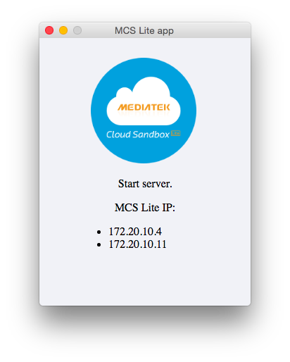

# 17.1 安裝 MCS Lite 私有雲環境

MCS Lite App 是一套完全以 JavaScript 撰寫而成的 IoT 私有雲，並且使用到 [wotcity.io](https://github.com/wotcity/wotcity-wot-framework)  Web of Things Framework套件。

## Step 1：安裝 MCS Lite App

MCS Lite 是 MCS 的離線版本，可安裝在本地裝置，例如：支援 JavaScript 環境的 IoT 開發板、Notebook 或智慧型手機。MCS Lite App 是 MCS Lite 的 Desktop Application 套件，目前支援 Windows 64-bit 與 MacOS 64-bit 二個平台；下載位址分別如下：

* [MCS Lite App for MacOS X (64-bit)](http://s3-ap-southeast-1.amazonaws.com/mtk.linkit/mcs-lite-app/osx64.tar)
* [MCS Lite App for Windows (64-bit)](http://s3-ap-southeast-1.amazonaws.com/mtk.linkit/mcs-lite-app/win64.zip)

以下說明使用 MacOS X 環境。下載 [MCS Lite App for Windows (64-bit)](http://s3-ap-southeast-1.amazonaws.com/mtk.linkit/mcs-lite-app/win64.zip) 後，直接解壓縮並執行即可：

```
$ tar xvf ~/Downloads/osx64.tar
$ cd osx64/
$ open mcs-lite-app.app/
```

成功執行後，可以看到如圖 17.1 的畫面。



## Step 2：測試 MCS Lite App

在完成 MCS Lite App 安裝後，可以使用 ```wotcity.io``` 套件裡的測試程式，進行初步的 IoT 私有雲測試。

切換至 ```wotcity.io``` 套件的測試程式目錄：

```
$ cd mcs-lite-app/node_modules/wotcity.io/tests
```

開啟 ```websocket-send.js``` 程式，並修改 IoT 私有雲的伺服器 IP 地址：

```
client.connect(‘ws://172.20.10.4:8000/object/5550937980d51931b3000009/send', ‘’);
```

如圖 17.1，找到 MCS Lite IP 位址為 ```172.10.10.4```。修改完成後，執行此測試程式：

```
$ node websocket-send.js 
```

測試程式會模擬一個溫度感測器的節點（IoT Node），並且以 JSON 資料格式，將數據傳送給 MCS Lite App；成功執行可以看到以下畫面：

```
WebSocket client connected
Pushing: {“temperature”:14}
Pushing: {“temperature”:20}
Pushing: {“temperature”:19}
Pushing: {“temperature”:14}
```

接下來，就能使用自已的 Notebook 作為私有雲平台，進行 IoT 應用開發。

## 小結

MCS Lite 的目標，主要在滿足 IoT 的教學場景：教室對外網路不穩定或速度差、能建立私有雲平台、掌握自有資料與自建資料庫，與客製化 UI。


