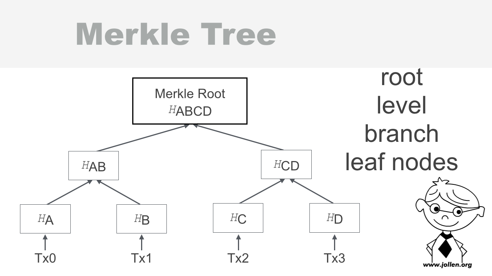

# 19.3 建立 Merkle Tree

## Merkle Tree 的生成過程

Merkle tree 用來存放交易資訊（transactions），為了要討論更詳細的 Merkle tree 生成過程，假設現在有 2 筆交易正在等候「處理」。這 2 筆交易資訊，分別以 ```Tx0``` 與 ```Tx1``` 來表示。


圖 22-5 生成 Merkle tree

Merkle tree 節點存放的是 double SHA-256 運算結果。如何將這 2 筆交易資訊，以 Merkle tree 來表示呢？以下是這一顆 Merkle tree 的生成過程。

將 ```Tx0``` 的本文（content）以 double SHA-256 進行雜湊運算，並將結果儲存在 ```HA```，表示方法如下：

```
HA = SHA256( SHA256(Tx0) )
```

同理，再將 ```Tx1``` 進行 double SHA-256 運算，結果儲存於 ```HB```：

```
HB = SAH256( SHA256(Tx1) )
```

SHA-256 的運算結果，是一個 64 bytes 的 HEX（十六進位）字串。在得到 ```HA``` 與 ```HB``` 後，就將這二個字串連接（concat）在一起，成為一個 64*2=128 bytes 的字串，這裡以 ```HA + HB``` 來表示。

再將 ```HA + HB``` 進行 double SHA-256 運算，結果儲存於 ```HAB```：


```
HAB = SAH256( SHA256( HA + HB ) )
```

得到的結果 ```HAB``` 就是 ```HA``` 與 ```HB``` 的父節點。這就是一個 3 個節點的 binary Merkle tree。

## 更多交易

如果現在有 ```Tx0```、```Tx1```、```Tx2``` 與 ```Tx3``` 共 4 筆交易呢？完整的 double SHA-256 運算過程就是：

```
HA = SHA256( SHA256(Tx0) )
HB = SAH256( SHA256(Tx1) )
HC = SAH256( SHA256(Tx2) )
HD = SAH256( SHA256(Tx3) )

HAB = SAH256( SHA256( HA + HB ) )
HCD = SAH256( SHA256( HC + HD ) )

HABCD = SAH256( SHA256( HAB + HCD ) )
```

最後得到的 binary Merkle tree 就是圖 22-5。

## 使用 Node.js 打造 Merkle Tree

Node.js 開發者不一定要自行實作 Merkle tree 演算法，網路上能找到開放源碼的實作。在 GitHub 上可以找到 [Merkle](https://github.com/c-geek/merkle) 模組，這是 JavaScript 的 Merkle tree 實作，並且支援 SHA-256 在內的多種 hash algorithm。

### Step 1：安裝 Merkle 模組

先安裝 Merkle 模組：

```
$ npm install merkle --save
```

接著引入 ```merkle``` 模組：

```
var merkle = require('merkle');
```

建立 root node，並指定使用 SHA-256 演算法：

```
var merkleRoot = merkle('sha256');
```

### Step 2：準備交易資訊

宣告幾筆交易資訊，例如：

```
// 建立一筆新的交易紀錄
var tx = ['Created by Jollen'];
```

交易的內容，現階段可任意填寫。例如，如果有 4 筆交易資訊：

```
// 建立 4 筆新的交易紀錄
var tx = ['a', 'b', 'c', 'd'];
```

現在只是練習 Merkle tree 的生成，暫時還沒有定義交易的資料結構，所以填寫任意內容即可。

### Step 3：建立完整 Merkle Tree

呼叫 ```async``` 函數，傳入所有交易資訊來建立 Merkle tree：

```
merkleRoot.async(tx, function(err, tree){
});
```

透過 Callback 函數來取得 Merkle tree。根據 Merkle 官方文件的說明，可以呼叫 ```tree``` 物件的 ```root``` 函數，來取得 Merkle root 的 Hash 值。以下是完整的範例列表：

```
var merkle = require('merkle');
var merkleRoot = merkle('sha256');

// 建立一筆新的交易紀錄
var tx = ['a', 'b', 'c', 'd'];

merkleRoot.async(tx, function(err, tree){
    console.log( tree.root() );
});
```

結出結果：

```
AB4587D9F4AD6990E0BF4A1C5A836C78CCE881C2B7C4287C0A7DA15B47B8CF1F
```

## 更多 Merkle Tree 資訊

如圖 22-6 所示，Merkle tree 是 binary tree（二元樹），以 4 筆交易量來看，總計會有 6 個節點（nodes），並且「高度」為 3。這個高度稱為 level。



圖 22-6 Merkle Tree 的 depth 為 2

這是一個 levels 為 3 的 Merkle tree，排除 leaf nodes 後的高度稱為 depth。所以：

* ```HA``` 與 ```HB``` 稱為 leaf nodes
* 這個 Merkle tree 的 depth  為 2
* 這個 Merkle tree 的 level 為 3

延續上述範例，取得該 Merkle tree 的 depth 與 levels：

```
merkleRoot.async(tx, function(err, tree){
    console.log( tree.root() );
    console.log( tree.depth() );
    console.log( tree.levels() );    
});

```

結出結果：

```
AB4587D9F4AD6990E0BF4A1C5A836C78CCE881C2B7C4287C0A7DA15B47B8CF1F
2
3
```

此外，呼叫 ```level``` 函數，可以取得指定 level 的所有節點，例如：


```
merkleRoot.async(tx, function(err, tree){
    console.log( tree.level(1) );
});
```

輸出結果：

```
[ '6A20F2EE7789E6BB7F404CC2DD729FF308B724D904F6A455B74D4851ADE5AECB',
  'A99E82F486656840A790C0EF6024D2C02359DE7674A587562FEB81C8970F24DD' ]
```

如圖 22-6 所示：

* level 0 是根節點（root）
* level 1 有 2 個節點

如果要顯示所有的節點，要怎麼修改程式碼呢？答案如下：

```
merkleRoot.async(tx, function(err, tree){
    // 印出所有節點
    for (i = 0; i < tree.levels(); i++) {
        console.log( tree.level(i) );
    }
});
```

## 視覺化 Merkle Tree

實際撰寫程式，來觀察 4 筆交易資訊的 Merkle tree：

```
var merkle = require('merkle');
var merkleRoot = merkle('sha256');

// 4 筆交易資訊
var tx = ['a', 'b', 'c', 'd'];

merkleRoot.async(tx, function(err, tree){
    // 印出所有節點
    for (i = 0; i < tree.levels(); i++) {
        console.log( tree.level(i) );
    }
});
```

輸出結果：

```
[ 'AB4587D9F4AD6990E0BF4A1C5A836C78CCE881C2B7C4287C0A7DA15B47B8CF1F' ]
[ '6A20F2EE7789E6BB7F404CC2DD729FF308B724D904F6A455B74D4851ADE5AECB',
  'A99E82F486656840A790C0EF6024D2C02359DE7674A587562FEB81C8970F24DD' ]
[ 'CA978112CA1BBDCAFAC231B39A23DC4DA786EFF8147C4E72B9807785AFEE48BB',
  '3E23E8160039594A33894F6564E1B1348BBD7A0088D42C4ACB73EEAED59C009D',
  '2E7D2C03A9507AE265ECF5B5356885A53393A2029D241394997265A1A25AEFC6',
  '18AC3E7343F016890C510E93F935261169D9E3F565436429830FAF0934F4F8E4' ]
```

為了幫助學習，圖 22-7 以視覺化的方式，來呈現這個範例的結果。


圖 22-7 視覺化 Merkle Tree

## 小結

現在，你學會了如何使用 Node.js 來生成 Merkle tree，並且也更進一步了解 Merkle tree 的結構。
