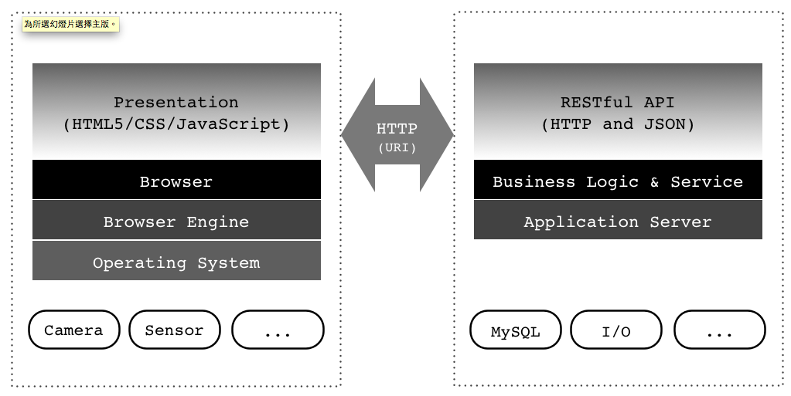
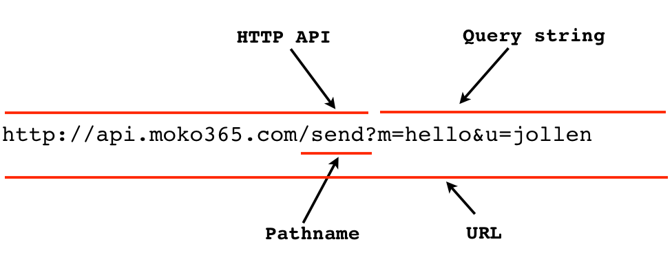
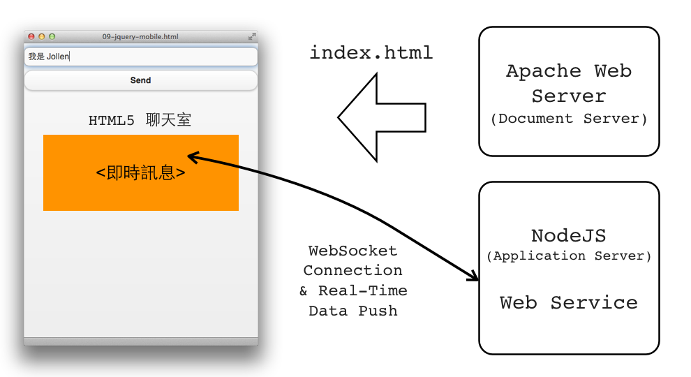

# HTML5 軟體開發的概念

HTML5 不只是技術，它是 Mobile + Cloud 的全新時代。HTML5 重新發明了 Web，現在的 Web 已不同以往。對完全不懂 HTML5 的創業人，本章內容將對您有很大的幫助。  

圖 2.1 把 HTML5 與 Cloud 的關係，做了很簡單的說明。圖 2.1 同時也是 HTML5 軟體開發的起點，這是一張「系統」架構，而不是「應用程式」架構。因為廣意的 HTML5 包含用戶端與伺服器端；目前的用戶端，大多是行動裝置。所以 Mobile + Cloud 正好表達了 HTML5 中心哲學。

HTML5 系統架構屬於 Web Application 的做法，技術上來說，這是 Web 導向架構（WOA, Web-Oriented Architect）。圖 2.1 的重點整理如下：

- Presentation 就是 View，也就是 App UI 的部份。用戶端使用 HTML5/CSS/JS 來打造 UI。
- UI 可以透過瀏覽器，來呼叫底層的 Device API。目前這個部份，需要在瀏覽器引擎裡，整合額外的軟體。目前最知名的 Device API 就是：PhoneGap。
- PhoneGap 技術，讓 JavaScript 可以呼叫到 Device API，HTML5 App 使用 JavaScript 就可以控制硬體。可以想像成：透過網頁來控制硬體。
- 最重要的軟體是瀏覽器，它是應用程式的 Runtime。
- 伺服器端以 NodeJS 打造專用的 Application Server。
- NodeJS Application Server 提供 API：即 Web Service。這些 API 採用 URL 的形式呈現，也稱為 Open API、HTTP API 或 Platform API。技術上，正式的名稱為 RESTful API。
- 用戶端呼叫 Server 的 RESTful API 來存取服務。
- NodeJS 使用 JavaScript，但能存取 I/O，例如：資料庫、檔案等。這是NodeJS 的主要特點之一。
- 用戶端使用 JavaScript，伺服器也用 JavaScript，所以開發者，都用 JavaScript 程式語言：這是一個 All in JavaScript 的時代。
- 以 JSON 格式來交換資料，降低頻寬的使用。

## HTML5 的 Runtime 是瀏覽器

廣議上的HTML5必須搭配許多技術來綜合應用，所以HTML5倒底怎麼跟這些技術搭配、HTML5的軟體開發思想是什麼，以及HTML5應用程式的設計原則為何？

HTML5 來了。什麼最重要：Browser 最重要。因為所有 HTML5 App 都在 Browser 環境裡執行，所以，HTML5 App 的 Runtime 就是瀏覽器。

Runtime 是執行環境。過去應用程式都是在作業系統平臺上執行，並且採用 C/C++ 程式語言編寫，我們便將這類型的應用程式稱為 Native Application，即主動式應用程式，代表應用程式被編譯後（Compile）就是一個可主動執行的執行檔。

接下來 Android 出現後，帶動一個以 Java程式語言來開發App的風潮。Java 程式語言早在 Android 問世前就已經被發明出來，雖後在 Android App 的年代人氣達到頂峰。利用 Java 程式語言編寫的應用程式，都需要 Java 虛擬機（Virtual Machine）才能執行；Android 的 Java 虛擬機稱為 Dalvik VM。所有以 Java 撰寫的 Android App 都在 Dalvik VM 上執行，它是由虛擬器來管理並直譯，不能主動執行。

可以這樣想，第一代的 App 使用 OS 做為 Runtime。第二代的 App 使用 Java Virtual Machine 做為 Runtime，例如：Android。第三代的 App 將使用 Browser 做為 Runtime。所以，Runtime 就是個關鍵技術。以前沒有掌握好 OS 沒關係，過去沒掌握好 VM 沒關係，現在還是沒掌握好 Browser 技術，就很有關係了。

同時，過去桌面電腦(PC)的瀏覽器，正快速往手機裝置移動。 各家軟體大廠無不加碼研發人才，努力打造一個能完全相容 HTML5 的瀏覽器，在 2012 年10月份現身的 Windows 8 Mobile Phone，也在 HTML5 做了很大的改進。2012 年，更傳出 [Facebook 有意購併老字號的瀏覽器開發商 Opera][1]，這個傳言最後沒有成真，但顯示了瀏覽器在行動裝置產業的重要性。

[1]: http://www.techbang.com/posts/9559-facebook-to-buy-opera-browser "Facebook 要買下 Opera 瀏覽器，為自家瀏覽器預做準備？"

HTML5 成為移動網路的標準已經是既定的事實了，唯一的關鍵是它的普及性。而行動瀏覽器技術，直接決定了 HTML5 的普及速度。這會是科技業的大盛宴，當行動瀏覽器成熟，並且安裝到每一台行動裝置上時，HTML5 將開始展現它的強大影響力。這個的影響力的層面相當廣，它會普及到各行各業。

所有的行業，都需要雲端做為媒體，將資訊與服務Web化，Web化後都能整合到行動裝置上。在行動裝置上，可以使用瀏覽器來使用這些資訊與服務。很明顯地，HTML5 的影響力將遠超過當年的 Android。

當年的 Android 作業系統，還不算是各行各業的事情。但是，HTML5 將影響到科技業、銀行業、出版業、遊戲業等等，數都數不清的行業別都將因 HTML5 起變化。將透過雲端將資訊與服務，傳遞到手機上的行業，都需要 HTML5。

所以，從產業的角度來看，「HTML5 = Mobile + Cloud」，這很簡單地說明了一切。從技術上來看，瀏覽器也是非常重要的「通路」，因為掌握了瀏覽器，等於控制了使用者的手機。瀏覽器開發廠，可以在瀏覽器「內置」一些資訊與服務。在瀏覽器內置服務，這一想就知道是多麼可怕的一件事情，這比起當初微軟在其作業系統裡內建IE瀏覽器還可怕。

接下來的幾年，科技業的主流發展趨勢，幾乎正式抵定了，就是「手機、行動瀏覽器與雲端應用」。各大瀏覽器與 HTML5 的相容性，成為相當重要的指標。因運而生的網站 html5test.com 可以幫助我們了解瀏覽器的 HTML5 相容性。

根據 html5test.com 的測試報告，桌面瀏覽器 (Desktop) 平均分數仍然領先行動 (Mobile) 瀏覽器，可見 HTML5 行動瀏覽器，仍有很大的發展空間。

目前在桌面瀏覽器的部份，來自北京的 [Maxthon 瀏覽器以 476 分取得第一][2]，領先第二名的 Chrome 29。在行動瀏覽器方面，Opera 目前是市佔率的龍頭，在 html5test 上的分數也佔於領先地位。不過，尚未正式發表的 Tizen 目前也突破了 400 分大關，是值得留意的潛力股。

[2]: http://html5test.com/results/desktop.html "2013 年 10 月份的數據"

## 從 Chrome 瀏覽器談起

Android 版的 Chrome 瀏覽器出現了，Chrome 是 HTML5 發展史的一個重要指標。預計今年 HTML5（Chrome）將全面走入各式產品，這宣告純硬體時代正式結束了。未來的產品，少了軟體與雲端的加持，將顯得平傭而無奇。純硬體能走進市場的機會，只會越來越少。手機肯定首當其衝。特別是 Android 版的 Chrome 瀏覽器現身了，它將引發新軟體革命嗎？

我們知道，雲端應用目前有二大龍頭：Google 與 Facebook。Google 老大哥的 Gmail、相簿、位置服務等，儼然成為一項民生必須品。Facebook 則是在社交網路（Social Networking）領域獨佔鰲頭。他們都是網路巨擎，也都是以平臺（Platform）的概念經營。平臺的概念是什麼？簡單說，就是提供開發者 API 服務。

## 理解平臺的概念

平臺是一個很容易理解的概念，就像大家手上的手機，裡頭安裝了許多使用到 Google 以及 Facebook API 的 App；這些 App 都會透過「雲端」，存取其服務。iPhone 與 Android手機裡的這些「雲端 App」，所使用到的核心技術，就是 HTML5。這代表著，[只要 HTML5 的規格能開始推出草案][3]（Draft），並且手機上的 HTML5 瀏覽器技術更加成熟，手機行業將會展開一場 HTML5 大戰。

[3]: http://www.jollen.org/blog/2012/02/html5-evolution.html "該來的終於來了：HTML5大戰拉開序幕"

HTML5 大戰就是雲端運算的戰爭，這肯定是新一波的軟體革命。以 HTML5 技術，結合網路服務、開發 App，並整合至手機，將成為顯學。

所以，筆者認為，Android 版 Chrome的到來，從產業的角度來看，肯定是一個重要指標，具有特別的意義。它將帶領 HTML5 往前衝刺。其實，Chrome 很早就是 HTML5 的領頭羊了，例如：早在 2010 年，Google 就宣佈以 [HTML5 取代 Google Gear 技術][4]，從這裡可見一斑。

[4]: http://www.ithome.com.tw/itadm/article.php?c=66509 "Chrome 12將正式以HTML5取代Google Gear"

我們可以這樣假設：有了 Chrome，雲（Cloud Computing）就更容易放進裝置裡。正因為如此，所以 Chrome 的出現，有了 HTML5 大戰的煙焇味。Chrome 將加速雲端應用走進手機 App，所以手機不能只有硬體功能，硬體廠將面臨新的一波挑戰。

## 從 Web Page 到 Web App

現在，我們可以使用 HTML5+JavaScript 來編寫應用程式，並且以瀏覽器來瀏覽。因此，HTML5 應用程式，說白了就是一種 Web 應用程式，透過瀏覽器來「瀏覽」它。這種使用案例已經存在已久，例如：用瀏覽器打開 Gmail 應用程式，收發郵件。所以，HTML5 應用程式並不是新鮮技術，就是我們所熟悉的 Web 應用程式。

Web 應用程式的執行環境就是瀏覽器。以 Web 技術來製作應用程式的概念、價值與優點就不必多說了，例如：跨平臺、跨裝置等等，就是大家熟悉的優點。試想，不管我是用個人電腦、手機或平板電腦，甚致是電視，只要有瀏覽器、有網路，就可以隨時隨地收發 Gmail。正因為這樣的優點，Web 應用程式有相當大的優點，以及潛在的商業價值。而 HTML5 就是 Web 應用程式的標準，這就是為什麼 HTML5 將成為主流技術、為什麼 HTML5 會走紅，以及為什麼各行各業的每個人，都要學習 HTML5 的原因。

## HTML5 時代來臨

HTML5 的前身，其實是一份稱為 [Web Applications 1.0][5] 的網路標準草案，HTML5 的用途，不言而諭。HTML5 的身世說來可憐，在 HTML5 標準制定將近七年的時間，不太被網路界重視。還好，蘋果已故執行長 Steve Jobs 的高膽遠矚，讓 HTML5 在 2010 年有了強出頭的機會。這是大家知道的知名事件，Apple 官方宣佈不支援 Adobe Flash。

[5]: http://www.whatwg.org/specs/web-apps/2005-09-01/ "Web Applications 1.0"

HTML5 希望未來網路世界，有更加豐富的 Web Applications，這個願景即將成真。有二個原因。第一、HTML5 第一個正式的候選草案版本，將在今年，也就是2012年推出，這代表所有的瀏覽器 (Broswer) 軟體製造商，將會有一份可共同依循的開發標準。這就是業界的鐵則，任何技術標準化後，都能成為「產業標準」。科技業不用懷擬，HTML5 時代來了。

第二個原因、手機。HTML5 是標準的乞丐命、皇帝運，當初提出 HTML5 建議的 Opera Software 萬萬沒想到，2010 年 Steve Jobs 公開支持 HTML5，2011 年智慧型手機又大爆發，這些 iOS & Android 手機對於 Web 的熱切需求，促使 HTML5 有了大躍進的發展。我們不用再懷擬，這一切來的很突然，不過都是真的。

另一波的手機與網路革命展開了，產業生態巨變，一波未平、一波又起。前一波，被來勢兇兇的 Android 作業系統敲得頭昏腦漲嗎？還來不及反應過來的話，繫好安全帶，因為 HTML5 來了。

### All in JavaScript 的時代

歡迎來到「All in JavaScript」的程式樂園。JavaScript 過去曾經在動態網頁製作上紅極一時，後來有一段時間，因為開發人員重視 Server-side 技術的程度，遠勝於 Client-side，因此 JavaScript 又迅速沈寂。

2003 到 2007 年這段時間，應該是 JavaScript 最谷底的時候。而後在 2007 到 2009 年，因為Web 2.0 風格網頁，以及 jQuery 的盛行，再度得到開發者的重視。2010 到 2011 年因為 Mobile Native App 的大量流行，使得眾多開發者不再以 JavaScript 做為首選，再度走入低潮。

### 學好 JavaScript 程式語言

但是，HTML5 來了。jQuery 被大量使用在網頁設計上，不管是視覺效果、特效或使用者介面，因為 jQuery 相當便利的開發模式，讓 JavaScript 再度被重視了起來。再加上 HTML5 在後推了一把，JavaScript 儼然成為今年最受矚目的程式語言。所以，JavaScript 是「王者再臨」的最佳代言人。

現在，JavaScript 的主要用途，已經由過去的動態網頁（Dynamic Webpages），轉為開發 HTML5 App 角色；也就是 HTML5 的應用。我們不僅僅使用 JavaScript 製作有動態效果的網頁，還藉助它來開發大量的 UI interactive、使用者體驗的設計，以及最重要的雲端服務整合。

還有一個很重要的應用，就是「JavaScript in Browser」，也就是利用 JavaScript 來增強瀏覽器的功能，最為大家所熟悉的例子，就是 Google Chrome。Google Chrome 為了增強對 JavaScript 的支援與效能，開發了新的 JavaScript 引擎；在日記「HTML5 在手持裝置將開始爆發式成長」就提到了，「JavaScript 引擎的成熟度是關鍵」。

所以，測試 JavaScript 的使用案例（Use Cases）在各大瀏覽器的效能，更為一項重要的工程工作。更進一步地，由於 JavaScript 現在搭配 HTML5 來開發「軟體」，而不只是用來製作動態網頁，所以研究 JavaScript 的軟體設計模式，當然也就變成一門顯學；目前被廣為推薦的就是「Essential JavaScript Design Patterns」一書。

## JavaScript 也能開發雲端服務

時間到了 2012 年，在 HTML5 時代正式啟動的今天，JavaScript 成為軟體工程師的必修語言，也是程式設計初學者的最佳選擇。從去年大約 1.5％ 的使用率，飆升到這個月的 3.3％ 左右的使用率。再者，被熱烈炒作的「雲端運算」概念，現在也可以使用 JavaScript 來開發 Server-side 的雲端服務；這就是近二年爆起的新技術「NodeJS」。

所以，不管是 Client-side 或 Server-side，無論是網頁或雲端服務，都可以使用 JavaScript 一統天下了，接下來「All in JavaScript」將成為軟體開發的主流。雖然 JavaScript 還不是當今最受歡迎的程式語言，但是在「Browser & Cloud」的領域，頗有王者的感覺。JavaScript 無疑是王者再臨的代表。

### HTML5 + CSS3 + JavaScript

JavaScript 之所以在網頁設計上佔有重要地位，很重要一個原因是 jQuery 的流行。jQuery 是一個以 JavaScript 技術開發的框架（JS Framework)，並且簡單易學、又易用。使用 jQuery 讓網頁變得活潑、美觀、又具備高度互動性，是簡單不過的事情了。jQuery 是一個框架，網路上有眾多 JavaScript 程式設計師，為它編寫了數以萬計的插件（Plugings），這是 jQuery 能成功的重要原因。

例如，我想要設計一個有「淡入淺出」效果的「投影片撥放」網頁，利用 jQuery 以及相關插件，就可以在幾分鐘內完成。現在，瀏覽網頁就好像在使用應用程式一樣，就像我們瀏覽 Gmail 時，使用經驗跟應用程式已經不向上下了。所以，網頁不再只是網頁（Web pages），網頁是應用程式了；這就是 Web 應用程式。

## 為 HTML 加入應用程式特性

有哪些技術是 Web 應用程式的主要元素？首先，當然是 HTML 標籤。「以前」，最新版本的 HTML 標準是 HTML 4.0，但是它沒有「Web 應用程式」的特性，意思是說，HTML 4.0 其實不包含應用程式方面的標籤。然而，HTML 5.0 把這部份加入了，所以，HTML 5.0 是真正能支援應用程式特性的 HTML 標籤，HTML 5.0 是支援 Web 應用程式的第一個 HTML 版本。事實上，HTML5 完全就是朝 Web 應用程式的方向去制定。

HTML5 本身是標籤。標籤的核心精神是描述資料（Data），例如：文字內容、圖形、顏色等等，要有互動的 UI、要有動態效果，或是進行計算等「程式語言」的工作，就要在網頁裡加上程式碼，這個程式碼就是 JavaScript。如果覺得寫 JavaScript 很麻煩，jQuery 提供更簡便的方式，讓我們在網頁裡加上這些功能。

所以，要製作 HTML5 應用程式，除了 HTML5 標籤外，也要使用 jQuery，並且也要學習 JavaScript 程式設計。另外，我們也知道，HTML 將外觀樣式（Style）分開了，外觀樣式以 CSS 描述；目前 CSS 的最新標準是 3.0 版。

總結來說，HTML5+CSS3+JavaScript 就是 HTML5 應用程式的靈魂。初學者，就是要先掌握這三大技術元素。

## Over HTTP

用戶端與服務器是透過HTTP協定溝通，所以 Open API 的形式就是URL。例如：

http://www.moko365.com/enterprise/search?q=android

伺服器以 API 形式提供服務，供用戶端呼叫使用。API 也可以附加參數，稱為 Query String，如圖 2.2。

沒錯，這就是過去在學習 CGI 時的觀念。前面的部份是API，問號後接的就是 API 的參數，稱為 Query string。一串 Query strin g裡包含多個參數，以這個例子來說，用戶端在呼叫此 API 時，傳遞給服務器的參數如表 2-1。

{title="表 2-1 API 的參數"}
|參數    |值       |用途說明      
|-------|---------|--------------
|m      |'hello'  | 指定要傳送的訊息 (message)
|u      |'jollen' | 指定 Username

NodeJS 的重要技術之一，就是解析並且處理 API 與 Query String。NodeJS 使用了非常巧妙的機制來處理 API 與 Query String，後續會進行詳細的介紹。

另外，上述定義 API 的方式，是典型的 CGI 做法。這樣的 API 是基於 HTTP 協定，因此也稱為 HTTP API。目前定義 Web Service API 的做法，已經有標準了，稱為 REST。這部份後續再做說明。

## Web-Oriented Architect

Web 導向架構（WOA, Web-Oriented Architect）的精神一張圖就能講明白了。Web 導向架構著重幾個觀念：

- Device-Server 設計模式
- Device 端使用 Browser，以 Browser 做為執行環境（Runtime）
- Server 端提供 APIs，即 PaaS 概念
- Device-Server 採用非同步通訊（Asynchronous communication）

事實上，非同步通訊大家都使用過，就是 AJAX；AJAX  的第一個 A 就是 Asynchronous。但是考量 Server 端的負載（Loading），以及百萬連線（Millions requests）等級的處理能力需求，應該儘量少用 AJAX 機制。這就是 Device-Server 與 Client-Server 的差別，大家可能還不太明白。所以，將二者的差別簡單整理如下：

- Client-Server 做法：在瀏覽器裡（Client）主動向 Server 請求內容，Client 定時（如：每隔5秒鐘）發出請求，持續更新內容。
- Device-Server 做法：在裝置端（Device）和 Server 建立連線，Server 主動將更新內容推送（Push）給裝置端，更明確地說，裝置裡的瀏覽器，瀏覽器再將新內容刷新。

這樣就很清楚了，傳統的 Client-Server 做法是「Data Pull」，即主動去拉資料；Device-Server 的做法是「Data Push」，即推送資料，由 Server 在必要時才將資料推送給 Device。Data Push 的經典代表作就是 BlackBerry（黑莓機）的郵件服務。

為什麼 AJAX 不好用？因為 Server 要冒著「不知道有多少 Client、不知道同時有多少 Requests」的風險。畢竟，主動權在 Client 端，突然一個時間，幾十萬個 Client 來請求資料，每個人又是發瘋似地，每隔一秒來要一次，Server 豈不掛點了。

要達成 Data Push 的目的，有解決二個技術問題：

- Device 端要與 Server 建立永續性（Persistent）連線，也就是 Socket Connection
- Server 推送出去的資料，格式要有統一標準，且輕量化

要解決這二個問題，就是要使用我們在前一章所介紹到的二項技術：WebSocket 與 JSON。所以，總結目前的說明：HTML5 不只是 HTML5，廣義的 HTML5 應用程式，由眾多技術交互形成。

並且，Web 導向架構是 Client-Server 或 Device-Server。哪一種架構會是主流？這並沒有肯定的答案，不過大略可以區分如下：

- 從 Web Page 角度來看，以 Client-Server 為主，這像是傳統 PC 時代的使用案例
從 Web App 角度來看，將 Device-Server 為主

- Web App 的開發思惟，與 Web Page 有很大的不同。目前 Web App 的 UI 製作，採是強調跨螢幕與裝置的特性，這種設計稱為 Responsive Design。並且，Responsive Design 進向以行動裝置為預設值的做法，也就是「Mobie First」

再次總結這二種模式的重點，Client-Server 是 Data Pull 的概念，而 Device-Server 是 Data Push。Data Push 也稱為 Client Pull，表示用戶端主動更新（Refresh）資料；Data Push 則是 Server Push，由伺服器主動推送資料。

## Data Push 設計模式

Data Push 的優點之一，就是：處理百萬連線請求。原因很簡單。因為採用的是 Data Push 機制，所以伺服器可以控制用戶數；如果要處理用戶端超過 10 萬個（舉例），就可以將工作分散到其它伺服器。反之，Data Pull 的做法，難處在於，我們很難了解有多少使用者、在什麼時間，同時進行 Refresh。

Server 透過 WebSocket 找到裝置，並以 JSON 格式將資料推送給裝置，這就是 Data Push 的觀念。此外，Server 端應該以什麼技術來實作呢？看來看去，現在最實際的技術就是 NodeJS。以 NodeJS 技術開發一個專用的 Web Server，透過這個 Web Server 將資料包裝成 JSON 後，經由 WebSocket 送出。

Data Push 的設計模式如圖 2.3。

步驟如下：

- Client 建立與 Server 的 Persistent Connection（WebSocket）
- Server 保存此連線
- Server 有新的資料時，將 Data Push 給所有的Client（經由 WebSocket）
- Client 收到資料，並更新 HTML 內容

上述的步驟並不是什麼學問，因為是很典型的機制。不過，HTML5 已經制定標準做法了，就是 WebSocket。

### AJAX Refresh 重要性下降

AJAX 本質上是一種 Data Pull 模式，也就是由用戶端（Client）來拉取資料（因此也稱為 Data pull）。過去，開發者經常使用 AJAX 來實作 Refresh 功能。但是 AJAX Refresh 有以下的技術缺點：

- 可能造成 Server 的負載
- 不夠即時

即便 AJAX 可以不斷更新（Refresh）資料，但還是不夠即時。要打造「Real-time Web Application」不使用 Data Push 模式是辦不到。因為用戶端，也就是瀏覽器，是以「Refresh」方式向 Web Server 要求資料。例如：每隔1秒鐘請求一次資料。

使用 AJAX 與 Refresh 的模式，會讓伺服器端很難預期同時會有多少請求進來。可能在一些熱門時間，忽然有巨量請求，就會讓伺服器負載量提高，甚致有服務中斷的風險。

AJAX 也不夠即時，當伺服器有新內容時，必須依賴用戶端來主動要求，因此會造成一段「Latency」時間。傳統的「聊天室」網站就是這樣設計：必須更新網頁，才能看到新的聊天訊息。

從這個角度來看，NodeJS 的 Data Push 方式，才是好的做法。不過，AJAX 也不是全然沒有用處了。一些「Non Refreshing」的設計需求，AJAX 仍然非常有用，例如：設計「註冊表單」時，當使用者輸入帳號後，以使用 AJAX 向伺服器查詢「使用者帳號是否可用」。

差異是：使用 AJAX 的方式來呼叫 Open API，而不是不斷的 Refreshing 頁面。

另一個重點是，使用 NodeJS 與 Data Push 方式，才能實作真正的 Real-time Web Application。AJAX 搭配 Refresh 方式，顯然已經不合適了。

## Device API 的革命時代

HTML5 應用程式大致可分為：Web App 以及 Mobile App。HTML5 本來就是「Web Application」的概念，這是它的核心思想。當然，在手機上使用瀏覽器也能執行（瀏覽）Web 應用程式；開發者可以將瀏覽器做適度的封裝，例如：去除網址列，這會讓使用者「好像在使用 Native 應用程式」一樣。沒錯，HTML5 在 Mobile 應用程式的價值，就是提供與 Native應用程式「相同」的體驗。

不過，Web App 與 Mobile App 的概念已經糊模化了。事實上，Web App 可以很容易封裝成 Mobile App：只要有好的 Responsive Design 與 Web Service 設計。

要讓 HTML5 Mobile 應用程式，在手機上表現出 Native 應用程式的體驗，有一個很重要的條件，就是：HTML5 能存取 Device API。更簡單一點，要想辦法使 JavaScript 呼叫底層的手機 API。例如，在 Android 手機上，透過 JavaScript 去呼叫作業系統的 Java API，即 Device API。
這是頭一遭，能使用「做網頁的方式」來做出「手機應用程式」。使用 JavaScript 呼叫 Device API 的技術，幾年前出現了，它叫做 PhoneGap。

PhoneGap 技術的概念，就是填補瀏覽器與手機間的隔闔（Gap）。

這一定是一場革命，如果能用做網頁的方式來做出手機應用程式，代表不久的未來，設計師也能輕易開發手機應用程式。做技術的人來做應用程式，和設計師來做應用程式，不需要多加思考，也能知道設計師比技術人員更適合做出絕佳的應用程式，因為這是 UI 與 UX 當道的時代。

HTML5+JavaScript+PhoneGap 讓這場革命成形了。Adobe Systems 公司看出了 PhoneGap 的未來價值，所以它在 2011 年底，收購了 PhoneGap 的開發商，並且將 PhoneGap 整合至 DreamWaver 軟體裡。從 DreamWaver 5.5 開始，用 HTML5 製作手機應用程式，變得簡單不過了。

### Native Mobile App 設計模式

使用 HTML5 來製作 Native Mobile App 的重點在於：JavaScript 如何呼叫 Native API。Native API 也稱為 Device API，這是由裝置本身的作業系統所提供的API。

從技術的角度來看，採取了一種 DOM 與 Device API 連結（Binding）的方式，來達到上述目的。

接下來以 Android 作業系統為例， 說明 PhoneGap 的實作原理。Android 作業系統內建的瀏覽器，採用的 HTML 引擎稱為 Webkit，這是由蘋果公司（Apple Inc）所貢獻的開源項目。Android 收錄了 Webkit 做為主要的 HTML 與 JavaScript 引擎，並且將 Webkit 封裝成 WebView 元件，整合至 Android 框架內部。目前，Google 已經開發出自已的 JavaScript引擎，稱為 V8。

WebView 元件提供一個稱之為 addJavaScriptInterface() 的 API，這個 API 就是 PhoneGap 的核心

DOM（Documtnt-Object Model）是 JavaScript 存取 HTML 文件的物件模型，簡單來說，透過 DOM，JavaScript 便能存取網頁裡的物件。addJavaScriptInterface() 的原理，就是在 HTML 的 DOM 裡加入一個新物件，並且讓這個物件「Binding」到 Java 程式碼裡。

意思是說，這裡有一個連接 DOM 與 Java 層的物件，JavaScript 透過這個物件，就可以存取到 Java 層。addJavaScriptInterface() 是 DOM-to-Java 的 binding 實作。以下是 addJavaScriptInterface()的實作範例：

同樣的原理也可以應用在其它作業系統，例如：iOS、BlackBerry、Bada、Symbian、Window Mobile等。所以，使用PhoneGap來開發手機應用程式，可以很輕易達到「Write once, run anywhere」的目標。「寫一次、到處都能執行」是PhoneGap的主要價值，因為應用程式是使用HTML5+JavaScript來製作，在任何有搭載瀏覽器與PhoneGap的裝置上都能執行，並不受制於作業系統。

Android 作業系統採取 Callback object 的方式來實作「DOM-to-Java」，也就是，Java 應用程式裡的 Method，都是被 HTML5 裡的 JavaScript 程式碼所呼叫。所以在實作 Callback method 時，需要注意幾個重點：

- 避免 Long operation
- 避免 Blocking operation
- 避免使用 Java thread 來操作 Callback object

Android 應用程式是單線程（Single thread）模式，這個單一的線程稱為 Main thread（主線程），並且是由 Android DalvikVM 自動產生的。由應用程式自行產生的線程，則稱為 Worker thread。所以，如果在 Main thread 與 Worker thread 裡同時去操作相同的的實例（Instance），例如：Method call，這個實例就必須有能力處理重覆進入（Re-entrancy）的問題。

能處理重覆進入的 Method，也被稱為 Thread-safe method。簡單來說，不是 Thread-safe 的 Method，就只能在 Main thread 裡呼叫使用，不能由 Worker thread 來呼叫。在 Android 作業系統裡，與 UI 有關的 API，都不是 Thread-safe method；意思是說，透過 Worker thread 去操作 UI，並不是正確的做法。

將這個觀念呼應到上述的 Callback object。當 JavaScript 呼叫 Callback method 時，這個 method 如果不是 Thread-safe 的實作，就不能有其它的 Worker thread 來呼叫它。概念上，Main thread 與 Worker thread 是併行（Concurrent）的關係，所以這個現象是可能發生的。

### Open Web Devices 計畫

PhoneGap提供許多「API」給JavaScript開發者使用，透過這些API，JavaScript就可以呼叫Device API。所以，這些JavaScript API就要有標準，這是很容易了解的概念。PhoneGap就自已定義了API標準。

還有另外一個開放源碼的作業系統，也擁有與PhoneGap一樣的概念與技術，這個作業系統就是B2G(Boot-to-Gecko)。B2G也要一套這種API標準。然而，B2G並不採用PhoneGap的API標準，而是結盟電信營運商，成立一個開放標準計畫，來定義API標準。這個計畫就是Open Web Devices(OWD)。

使用PhoneGap或追隨OWD計畫，從商業面來看，並不是一個好主意。不過是PhoneGap或OWD，多少都隱含了一些商業企圖，以及競爭策略。身為設備製造商，「Build My Own」也是我的聰明選擇。

以Android作業系統為例，要做出PhoneGap技術，並不是很難，事實上，對熟悉Android技術的開發者來說，這是沒有技術難度的工作。現在，為大家解密PhoneGap的技術原理。

## 重要的資訊交換格式：JSON

筆者借用了 PaaS 行銷名詞，來介紹一個技術：JSON。PaaS 是一個很棒的概念，這就是一種雲端技術。然而，傳統做法，Client 端得到的是一個 HTML5 文件，而不是格式化後的資料（Formatted），這是一個缺點。

如果 Server 回傳的是格式化後的資料，Client 端就可以更有效率地利用這些資料。試想，如果 Google 傳回的搜尋結果是一堆 HTML5，那我們不就還要再去 Parse 這份文件，才能取出真正的結果，然後才能再次利用這些資料（例如：再儲存為 CVS 格式）。

為了解決這個問題，必須要有一個標準，不能大家都用自已的 HTML5 文件，或是自定的格式。軟體工程師設計了一些標準。一開始提出的做法，是制定標準的XML標籤，這樣大家就可以統一文件格式了。但是還有一個問題，就是「資料量太大」。

試想，Server 要回傳二筆資料，這二筆資料都是電話號碼：

- 0911-111-111
- 0900-000-000

然後用XML來表示，就變成：

~~~~~~~~
<Telephone>
   <Item>0911-111-111</Item>
   <Item>0900-000-000</Item>
</Telephone>
~~~~~~~~

這種把資料打腫了才回傳的做法，大大浪費網路頻寬。上面只是一個簡單的例子，現實環境，要回傳的資料可能是一個 10MB 的 XML 文件，結果原始資料可能只有 1MB。這就像，一個好端端的人，硬是被塞進了 9 公斤的肥肉。

要解決這個問題，就要有一個輕量級（Light-weight）的資料交換格式，這項技術就是 JSON。所以，JSON 是 Client/Server 交換資料的一種格式，一種Light-weight data exchange 技術。

還有一些不可不知的 HTML5 技術：

- PhoneGap：Device API 的標準，使用 JavaScript 呼叫 Device API 的好技術，Nitobi 公司是 PhoneGap 的開發商，這家公司現已被 Adobe Systems收購

- WebSocket：HTML5 標準裡的一個技術

- NodeJS：開發專用 Web Service 的技術，採用 JavaScript 語言。專用 Web 服務器是 Cloud 的重要領域。Apache Web Server 是普用型 Web Server，Cloud 需要專用的 Web Service

現在開發專用的 Web Service 非常重要，這是 PaaS 的靈魂。例如，開發股票報價專用 Web Server。過去常聽到的 Web Server，例如：Apache，都是一般用途的 Web Server，用來「host webpages」。

現在 Client 端的網頁是用 JavaScript，Server 端的開發也可以用 JavaScript，Client/Server 通通都用 JavaScript，這是一個「All in JavaScript」的時代。

## 結論

根據截至目前為止的介紹，可以歸納出二個 HTML5 的重要設計模式如下：

- Device-Server 設計模式（Data push）
- Native Mobile App 設計模式（DOM-to-Java bindings）
