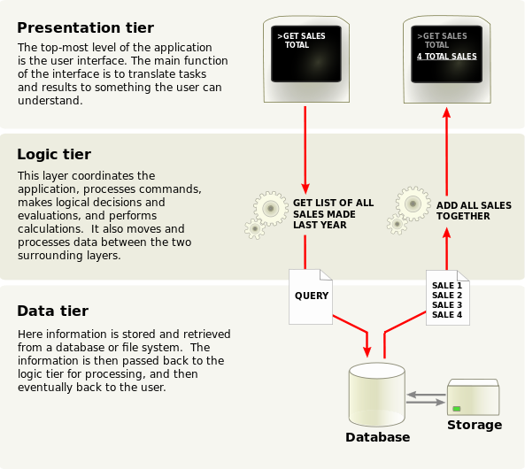
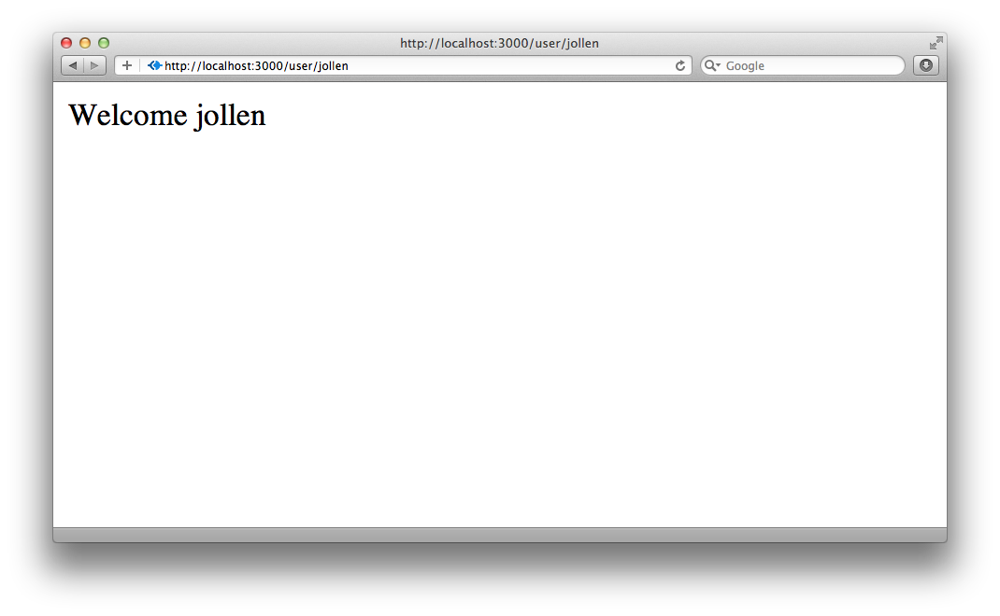

# REST API 架構 - 使用 Express.js

REST API 架構（或稱為 RESTful 架構）是[實作 Web Service 的一個方法][1]。Web Service 採用 SOA 設計模式，它的精神在於「Server 要以提供服務的形式存在」，至於提供服務的方式，就是對外公開 API。

[1]: http://www.ibm.com/developerworks/webservices/library/ws-restful/ "RESTful Web services: The basics"

所以，可以這樣歸納：RESTful 架構是實作 SOA 模式的一個好方法。技術上，RESTful 就是在定義與實作公開（Open）的 API。

很多時候，RESTful 架構與 SOA 是被劃上等號的，但這其實沒有衝突：

- RESTful 是技術上的說法，著重在技術的角度
- RESTful 是定義與實作 Web Service，即 Open API
- SOA 是偏向商業的說法，SOA 所討論的服務（Service）偏向在策略與商業邏輯

[REST 的目標就是要支援 Service-Oriented 的架構][2]。

[2]: http://www.zdnet.com/7-reasons-service-oriented-architecture-and-rest-are-perfect-together-7000007706/ "7 reasons service oriented architecture and REST are perfect together"

在繼續往下閱讀之前，請先了解以下內容：

- 了解圖 2.1（Web Service 導向架構），以及圖 2.1 的重點整理
- 關於 Web Service 技術面的本質，請參考第 6 章的說明
- 有關 REST 的基本概念，請參考 6.2 節的說明。

另外，第 8.5 節提到 Express.js 框架，能幫助開發者解決 4 個基本問題，其中之一就是「REST API 定義與實作」。

## 關於 SOA 與 3-Tier 架構

SOA（Service-Oriented Architecture）是一個熱門名詞，筆者認為，接下來幾年，它將成為 Web App 開發的主流架構。SOA 架構包含 Server 端，也就是 Web Service 的開發。

Node.js 是實作 Web Service 的優秀技術，因此成為 SOA 架構模式的熱門技術之一，許多新創公司紛紛選擇 Node.js 來開發創業作品。知名的團購網站 Groupon，不久前，[也宣佈將網站架構，轉移到 Node.js][3]。

[3]: https://engineering.groupon.com/2013/node-js/geekon-i-tier/ "Geekon: I-Tier"

要了解 SOA 的核心精神，就要由 SOA 的核心精神談起。SOA 本質上是一個軟體設計與架構的模式，也就是 SOA 是一個 Design Pattern。它主要被應用在 Web Service 軟體開發上，並且以 Event-Driven 的觀念，做為程式設計模式。

Event-Driven 的程式設計模式，與 Data-Driven 模式很像；Event-Driven 並不是 Procedure Programming（循序邏輯）的概念，它會比較偏向狀態機（State Machine）的程式邏輯。

實際上，State Machine 是 Event-Driven 的重要實作方法。Node.js + Express.js 開發者，如何引進 State Machine 的寫法呢？這部份後續再做討論。

### 3-Tier 架構

如何使用 SOA 設計模式，來架構 Web Service 呢？Web Service 的基礎建設，包含 Client 端與 Servier 端，在現在這個行動通訊裝置時代，Client 端也是 Device 端（設備端）。所以這個問題的答案並不難：採用典型的 Multi-Tier 架構。

Multi-Tier 架構又稱為 N-Tier 架構，最常見的就是 [3-Tier][4]，三層次架構。3-Tier 將 Web Service 的基礎建設，分為以下 3 層：

[4]: http://en.wikipedia.org/wiki/Multitier_architecture "Multitier architecture"

- Presenetation Tier
- Logic Tier
- Data Tier

Presentation Tier 是最上層的部份，也就是 User Interface。Logic Tier 進行邏輯處理與運算，例如：條件判斷、執行命令。Data Tier 負責儲存與讀取資料，資料儲放可使用資料庫，或一般的檔案系統。

3-Tier 架構是 Multi-Tier 架構的一種做法，除了 3 層式架構外，當然還有 4 層式，或是更多層的架構模式。3-Tier 架構的特色，就是把 Presentation Tier 與 Data Tier 完全隔離開來：

- Presentation Tier 無法直接與 Data Tier 溝通
- Logic Tier 負責處理 Data Tier 提供的資料，並搬移到 Presentation Tier

這個觀念，非常像 MVC（Model-View-Controller）設計模式，實際上 3-Tier 與 MVC 經常被混餚。但 3-Tier 與 MVC 最主要的差異，其實就是上面提到的 2 點。3-Tier 架構中，Presentation Tier 無法直接與 Data Tier 溝通；但 MVC 模式則具備此特性。

關於 MVC 模式的觀念，將在第 11 章，導入 Backbone.js 框架時，再為大家說明。

## Presenetation 在 Client 端

有了 3-Tier 與 REST API 架構的觀念後，再重新實作「即時聊天室 App」時，我們會發現整個思惟邏輯都不一樣了。主要的思考重點如下：

- Presentation 儲存在 Client 端，而不是 Server 端
- Express.js 僅負責提供 Presentation 文件，但不進行 Server-Side Rendering
- 透過 REST API 取得 Response Data 後，進行 Client-Side Rendering
- Client 與 Server 透過 API 形式連結，這就是 API Architecture 的觀念

再舉一個例子：實作即時新聞 App。典型的 PHP 開發者，是以「網頁」的概念來架構這個軟體，打造出來的軟體，Scenario 會是這樣：

1. Client 輸入 URL（網址）
2. Server 取得即時新聞
3. Server 將即時新聞 Parse 成 HTML 語法
4. 將完整的 HTML 文件送出
5. Client 端的瀏覽器顯示這份 HTML 文件

但以 REST API 架構觀念重構後，Scenario 應該是：

1. Client 端向 Server 請求 HTML 文件
2. Server 送出模板文件（Template）
3. Client 端瀏覽器顯示模板文件
4. Client 端呼叫 REST API，向 Server 取得即時新聞
5. Server 端以 JSON 格式返回即時新聞
6. Client 端解析收到的 JSON 資料，並顯示新聞至 UI 上的對應位置（這個觀念就叫做 ViewModel）

後者才是 REST API 架構的觀念，也是 3-Tier 架構的正確實作方法。這又是 Web Page 與 Web App 的另外一個重要差異：

- Web App 要考慮軟體架構，即 3-Tier 與 API Architecture
- Web Page 只是一份文件，而不是「軟體」

最後，經由以上的討論，可以知道一個很重要的細節：REST API 架構下，Client 與 Server 是經由 API 來連結，Presenetation（也就是 HTML5 文件）的部份，主要是放置在 Client 端。這才是正確的 REST API 架構觀念。當然 API 的定義與實作，並不一定要遵循 REST API 的規範，但重要的觀念是相同的，其通則如下：

- 任何以 API 架構來連接 Client 與 Server 端的實作，都要將 Presentation 放置在 Client 端
- Server 只做運算與服務供應，這就是 Service-Oriented Computing 的觀念
- 在 SOA 模式下，Server 理論上不供應「網頁文件」

思考清楚 REST API、SOA 與 Web Service 的觀念後，就讓我們來重新實作即時聊天室：nodejs-chat。範例可由 Github 取得：

	http://github.com/jollen/nodejs-chat

nodejs-chat 的開發是基於 http://github.com/jollen/nodejs-express，因此請在完成前 9 個章節的學習後，再繼續往下閱讀。

## Express.js 與 REST API

Express.js 實作 REST API 的方式相當簡單，請參考下表。

{title="表 10-1 REST API 定義"}
|CRUD       |HTTP Method      |Express.js 實作函數    
|-----------|----------|--------------
|Create     |POST      |app.post()
|Read       |GET 	   |app.get()
|Update     |PUT       |app.put()
|Delete     |DELETE    |app.delete()

Express.js 能支援 CRUD 所需的所有 HTTP Methods。所以，我們只要知道，在實作 URL Routing 時，要如何指定特定的 HTTP Methods 即可。例如：

~~~~~~~~
app.get('/', routes.index);
~~~~~~~~

這是先前我們一直採用的寫法，*get()* 函數的另外一個涵義就是 GET HTTP Method。所以，當用戶端以 GET Method 請求 *'/'* 這個 URL 時，才會被 Routing 到 *routes.index* 函數。同理，以下的例子：

~~~~~~~~
app.post('/', routes.index_add);
~~~~~~~~

當用戶端以 POST Method 做請求時，就會被 Routing 到 *routes.index_add* 函數。同樣的 URL，可以依據不同的 HTTP Request Method，來做不同的處理（即 CRUD）。

此外，在定義 REST API 時，會需要這樣的 URI 格式：

~~~~~~~~
/user/{username}
~~~~~~~~

比如，要讀取 *jollen* 與 *ellaine* 二位使用者的資訊，就要分別呼叫以下的 API：

~~~~~~~~
/user/jollen
/user/ellaine
~~~~~~~~

這二個 URI 理論上應使用同一個 URL Routing Handler，而不是為這二位使用者，實作獨立的 Routing Handler。例如，以下的寫法並不正確：

~~~~~~~~
app.get('/user/jollen', user.jollen);
app.get('/user/ellaine', user.ellaine);
~~~~~~~~

以 REST API 的角度來說，這是相同的 Resource，同樣的 User Resource，使用同一個 Routing Handler 即可。要解決這個問題，只要將程式碼改寫如下即可：

~~~~~~~~
app.get('/user/:username', user.index);
~~~~~~~~

Express.js 支援以變數（Variable）的方式來定義 URI，因此，不管是 */user/jollen* 或 */user/ellaine* 使用者，只要符合 */user/:username* 的格式，都會被 Routing 到 *user.index* 函數。

### 讀取 URI 的參數

如何在 Routing Handler 裡讀取 URI 裡的變數呢？範例如下：

~~~~~~~~
exports.index = function(req, res){
  res.send("Welcome " + req.params.username);
};
~~~~~~~~

URI 的變數值，也視為「參數」的觀念，這些工作 Express.js 都幫我們做好了。如何讀取 *:username* 變數的值呢？只要直接使用 *req.params* 物件即可。以上述範例來說，如果在瀏覽器輸入以下 URI：

~~~~~~~~
http://localhost:3000/user/jollen
~~~~~~~~

就能看到以下的執行結果。從這個結果得知：*:username* = *jollen*。

## RESTful 架構實務 - 即時聊天室

歸納 REST API 的觀念，得到以下 4 個 [RESTful 實作原則][1]：

1. 使用 HTTP Method 實作 CRUD（請參考 6.3 節與表 6-1）
2. Stateless（無狀態模式）
3. 以目錄結構形式定義 URI（請參考 6.1 與 6.2 節）
4. 使用 JSON 做為資料交換格式（請參考 2.12 節與第 4 章）

除了 Stateless 外，其餘所需要的背景知識，都已經做過介紹。關於 nodejs-chat 專案的功能，整理如下。

[1]: http://www.ibm.com/developerworks/webservices/library/ws-restful/ "RESTful Web services: The basics"

### Nodejs-Chat Server 

Server 的部份，應實作以下功能：

- 產生最新訊息的 JSON，並回應給 Client 端應用程式
- 接收 Client 端傳送的訊息，並儲存最新的 *n* 筆訊息

### Nodejs-Chat Client Application

Client Application 的部份，應實作以下功能：

- 輸入即時訊息
- 呼叫 REST API，傳出訊息給 Server
- 經由 WebSocket 接收即時訊息
- 呼叫 REST API，取得最新的 *n* 則訊息

接下來，請依以下步驟，練習實作 nodejs-chat 專案。

### Step 1：定義 REST API

假設主機名稱為 chatservice.org，接著定義 nodejs-chat 專案的 CRUD 操作，如表 10-2。

{title="表 10-2 REST API 定義"}
|CRUD       |HTTP Method      |URI 格式      
|-----------|----------|--------------
|Create     |POST      |http://chatservice.org/discussion/{message}
|Read       |GET 	   |http://chatservice.org/discussion/latest/{items}
|Update     |PUT       |無
|Delete     |DELETE    |無

這是一份最低消費的定義：僅支援新增與讀取訊息的功能。例如，現在要傳送 "Hello" 訊息，Client 端應呼叫的 API 為：

	http://chatservice.org/discussion/hello

如果要讀取最新 10 筆訊息，應呼叫的 API 為：

	http://chatservice.org/discussion/latest/10

請注意幾個重要觀念：

- 儘可能避免使用 Query String
- 不要使用空白字元（Space）
- 全部小寫

此外，REST API 的 URI 類似於目錄結構，所以我們可以這樣解釋：

~~~~~~~~
$ mkdir discussion
$ cd discussion
$ mkdir 5d41402abc4b2a76b9719d911017c592
$ cd 5d41402abc4b2a76b9719d911017c592
$ echo "hello" > db.txt
~~~~~~~~

接著，會得以下的 Tree-Structure：

~~~~~~~~
.
└── discussion
    └── 5d41402abc4b2a76b9719d911017c592
        └── db.txt
~~~~~~~~

上述的數字串，是一個 MD5 編碼，用來做為這筆資料的「ID」。如果第二筆資料，這個樹狀結構會成長成這樣：

~~~~~~~~
.
└── discussion
    ├── 5d41402abc4b2a76b9719d911017c592
    │   └── db.txt
    └── 7d793037a0760186574b0282f2f435e7
        └── db.txt
~~~~~~~~

一開始學習 REST API 定義的初學者，經常犯的錯誤，就是誤解了 REST API 的「Resource」意義。比如說，以下這個結構是不好的：

~~~~~~~~
.
├── discussion1
│   └── db.txt
├── discussion2
│   └── db.txt
└── discussion3
    └── db.txt
~~~~~~~~

REST API 的根節點（root node），也就是 */discussion*，它 是一個資源名稱（Resource）；而這個資源在整個系統裡，應該只有一個（一份）。理論上，root node 要符合 Singleton 設計模式的要求。

### Step 3：實作 URL Routing

修改 app.js，加入以下程式碼：

~~~~~~~~
var discussion = require('./routes/discussion'); // ./routes/discussion.js

app.post('/discussion/:message', discussion.create);
app.get('/discussion/latest/:items', discussion.read);
~~~~~~~~

參考表 10-1 與表 10-2，得到以下結論：

- 建立訊息要使用 POST Method，因此使用 *app.post()* 函數來建立 URL Routing
- 讀取訊息要使用 GET Method，因此使用 *app.get()* 函數來建立 URL Routing

URL Routing 的實作部份，只需要將 URI 的變數讀出，再放入資料庫即可。由於尚未介紹 Node.js 與資料庫的應用，因此現階段暫時以 Global Array 來存放。*discussion.js* 目前的實作如下：

~~~~~~~~
/*
 * URL Routing Handlers
 */
 
exports.create = function(req, res){
  console.log("CREATE: " + req.params.message);
};

exports.read = function(req, res){
  console.log("ITEMS: " + req.params.items);
};
~~~~~~~~

如果要新增 'hello' 訊息，就要呼叫這個 API：

	http://localhost:3000/discussion/hello

但是，如果直接使用瀏覽器去開啟的話，會出現「404」找不到網頁的錯誤，為什麼呢？因為瀏覽器是以 GET Method 來做請求，這可以由 Node.js 的 Console 訊息得知：

~~~~~~~~
$ node app.js 
Express server listening on port 3000
GET /discussion/hello 404 9ms
~~~~~~~~

所以，現在我們改用另外一個工具 *curl* 來做測試：

~~~~~~~~
$ curl -X POST http://localhost:3000/discussion/hello
~~~~~~~~

使用 *-X* 參數即可指定 HTTP Method。測試時，可以看到以下的 Console 訊息：

~~~~~~~~
$ node app.js 
Express server listening on port 3000
CREATE: hello
POST /discussion/hello 200 120013ms
~~~~~~~~

程式碼框架完成後，就可以進行實作工作了。以下是 *discussion.js* 的完整程式碼。

{title="routes/discussion.js"}
~~~~~~~~
 1 /*
 2  * URL Routing Handlers
 3  */
 4 
 5 var history = [];	// 存放訊息
 6 
 7 exports.create = function(req, res){
 8   console.log("CREATE: " + req.params.message);
 9 
10   // 先打包為 JSON 格式
11   var obj = {
12   	message: req.params.message
13   };
14 
15   // 再儲存至 history 陣列
16   history.push(obj);
17 
18   // 製作 Response 訊息 (JSON 格式)
19   var response = {
20   	status: "OK"
21   }
22 
23   // 回傳 Response 訊息
24   res.write(JSON.stringify(response));
25   res.end();
26 };
27 
28 exports.read = function(req, res){
29   console.log("ITEMS: " + req.params.items);
30 
31   // 取出最新的 {req.params.items} 筆訊息
32   var latest = history.slice(0 - req.params.items);
33 
34   // 回傳
35   res.write(JSON.stringify(latest));
36   res.end();
37 };
~~~~~~~~

可以利用以下的連續命令進行測試：

~~~~~~~~
$ curl -X POST http://localhost:3000/discussion/hello1
$ curl -X POST http://localhost:3000/discussion/hello2
$ curl -X POST http://localhost:3000/discussion/hello3
$ curl -X GET http://localhost:3000/discussion/latest/2
$ curl -X GET http://localhost:3000/discussion/latest/1
$ curl -X POST http://localhost:3000/discussion/hello4
$ curl -X POST http://localhost:3000/discussion/hello5
$ curl -X GET http://localhost:3000/discussion/latest/3
$ curl -X GET http://localhost:3000/discussion/latest/5
~~~~~~~~

以下是相對應的 Console 訊息：

~~~~~~~~
$ node app.js 
Express server listening on port 3000
CREATE: hello1
POST /discussion/hello1 200 30ms
CREATE: hello2
POST /discussion/hello2 200 2ms
CREATE: hello3
POST /discussion/hello3 200 1ms
ITEMS: 2
GET /discussion/latest/2 200 1ms
ITEMS: 1
GET /discussion/latest/1 200 1ms
CREATE: hello4
POST /discussion/hello4 200 2ms
CREATE: hello5
POST /discussion/hello5 200 0ms
ITEMS: 3
GET /discussion/latest/3 200 1ms
ITEMS: 5
GET /discussion/latest/5 200 9ms
~~~~~~~~

一切就續後，就可以開始製作 Front-end 了。在這之前，可以開始試著建立測試程式，並加入簡單的 Test Case。否則，等到 API 數量更多，以及 Use Scenario 更複雜時，測試工作就更費勁了；因為將會有更多、更複雜的測試命令等著我們 Key In。

### Step 4：實作 Test Case

Test Case 是軟體開發很重要的一環，上述以 *curl* 指令進行測試，基本上這是比較不正式的做法。如果能撰寫一些測試程式，未來在開發的過程，就能很方便而且快速地測試新版本軟體。Test Case 一般是在軟體的開發過中，不斷地累積，並且隨著我們的專案釋出；因此，一開始就養成撰寫 Test Case 的習慣，絕對會比事後補上更好。

筆者建議持續以 Node.js（JavaScript）來為 nodejs-chat 專案開發 Test Case。要將上個步驟的 *curl* 指令，取代為 Test Case，就要知道如何以 Node.js 來製作 HTTP Client：方式是使用 Node.js 的 *http* 模組。不過，還有更簡便的解決方案：使用 [Requestify][5]。

[5]: http://ranm8.github.io/requestify/ "Simplifies node HTTP request making."

開啟 nodejs-chat 專案下的 *package.json* 檔案，加入 *requestify* 模組：

~~~~~~~~
{
  "name": "application-name",
  "version": "0.0.1",
  "private": true,
  "scripts": {
    "start": "node app.js"
  },
  "dependencies": {
    "express": "3.4.4",
    "jade": "*",
    "requestify": "*"
  }
}
~~~~~~~~

安裝相依模組：

~~~~~~~~
$ npm i
~~~~~~~~

新增 *tests/* 字目錄，用來存放 Test Case：

~~~~~~~~
$ mkdir tests
$ cd tests
~~~~~~~~

在 *test/* 目錄下建立第一個測試程式，將檔案命名為 *01-test-discussion-create.js*；*requestify* 的使用方式非常簡單，完整程式碼如下。

{title="tests/01-test-discussion-create.js"}
~~~~~~~~
1 var requestify = require('requestify'); 
2 
3 requestify.post('http://localhost:3000/discussion/hello', {
4     // POST 的 Request Body，例如：訊息夾帶的圖片。目前為空。
5 })
6 .then(function(response) {
7     // 取得 Response Body
8     response.getBody();
9 });
~~~~~~~~

上述步驟，說明了實作 nodejs-chat 的重要觀念，完整的 REST API 實作，請參考完整的範例程式。關於 nodejs-chat 的完整程式碼，可由 *http://github.com/jollen/nodejs-chat* 取得。這個範例僅只是簡單的 Test Case，各位可以試著自行撰寫更多的測試程式，並設計更完整的 Test Case。

## 結論

學習 REST API 的定義，以及如何利用 Express.js 框架來實作 API，是本章的重點。關於 Client Application 的製作，將會需要討論幾個觀念：

- MVC 設計模式的使用
- 使用 jQuery 呼叫 REST API
- 使用 Backbone.js 呼叫 REST API（又稱為 Backbone Way）

Client Application 的製作，將於第 11 章另行說明。

