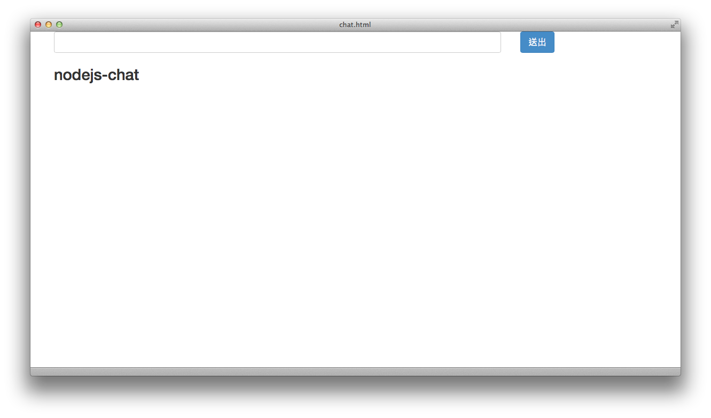
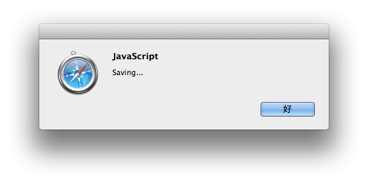

# MVC 架構實作 - Backbone.js 入門

現代的 Web App 開發，是以 Web Service 為主軸，以 API 的方式整合 Client（Device）與 Server。API 為主軸的架構中，又以 RESTful 最受到矚目，RESTful 將可能成為是未來的 Web Service 主流架構。RESTful 易於 Web Service 與不同裝置的整合，例如：Desktop、Phone、Tablet 與 TV 等

前一個章節，我們學到幾個重要觀念：

* 以 JSON 做為主要的資料交換格式
* Client 端使用樣板（Client-side HTML Template）
* Key-Value Paris

有了這幾個觀念後，就能開始導入 Backbone 框架，並且將 nodejs-chat 發展的更完善。首先，先為 */discussion/:message* API 製作一個輸入介面，並且採用 Backbone 框架來呼叫 REST API。

## 初學 Backbone Way

### Step 1：安裝 Underscore 與 Backbone

先到 Underscore 網站下載 *underscore-min.js*：

~~~~~~~~
http://underscorejs.org/underscore-min.js
~~~~~~~~

再到 Backbone 網站下載 *backbone-min.js*：

~~~~~~~~
http://backbonejs.org/backbone-min.js
~~~~~~~~

將上述檔案存放至 nodejs-chat 專案的 *client/javascripts/* 目錄下。Backbone 必須與 Underscore 搭配使用。

### Step 2：修改 *chat.html*

加入以下二行：

~~~~~~~~

~~~~~~~~

將 Underscore 與 Backbone 加入 Frontend 頁面。幾個重要事項：

* 順序不能改變，必須先引入 Underscore 後，再引入 Backbone 才不會出錯
* Backbone 是一個 MVC 框架，其中 View 的部份由 Underscore 支援

### Step 3：重新撰寫 *client/javascripts/app.js*

將原本 *client/javascripts/app.js* 裡的內容全數刪除，並加入以下程式碼：

~~~~~~~~
/**
 * SETUP
 **/
  var app = app || {};

/**
 * MODELS
 **/

/**
 * VIEWS
 **/
  app.MessageView = Backbone.View.extend({
    events: {
    },
  });

/**
 * BOOTUP
 **/
  $(document).ready(function() {
    app.messageView = new app.MessageView();
  });
~~~~~~~~

這是撰寫 Backbone 的起點，幾個重要觀念解說如下：

* Backbone 是一個 MVC 框架，一開始先定義 Model 與 View
* Model 就是「表示資料的模型」，也就是將會顯示在畫面上的資料
* View 的部份將負責處理 Template 與 Model 的對應，必須先了解 Key-Value Paris 觀念
* View 的部份，也負責處理控制的部份，例如：Button 的 click 事件

### Step 4：文字輸入欄位與按紐

在 *chat.html* 裡加入文字輸入欄位與按紐。使用到 Bootstrap 的 [Grid System][1] 與 [Buttons][2] 樣式。

[1]: http://getbootstrap.com/css/#grid "Grid system"
[2]: http://getbootstrap.com/css/#buttons "Buttons"

以下是 *chat.js* 的完整內容：

{title="client/chat.html"}
~~~~~~~~
 1 <!DOCTYPE html>
 2 <html>
 3 <head>
 4 <link rel="stylesheet" href="stylesheets/bootstrap.min.css" />
 5 
 6 
 7 
 8 
 9 
10 
11 
12 </head>
13 
14 <body>
15 
16 

17 	

18 		

19 			<input class="form-control" type="text" name="message">
20 		

21 		

22 			<button class="btn btn-large btn-primary btn-message-save">送出</button>
23 		

24 	

25     

26         

27             <h3>
28                 nodejs-chat
29             </h3>
30             

31         

32     

33 

34 
35 </body>
36 </html>
~~~~~~~~

重點說明如下：

* 第 19 行：給輸入欄位的 *name* 是 "message"，後續將以 jQuery 選擇器搭配 *name* 屬性來找出這個物件
* 第 22 行：額外給予這個 <button> 元件一個 class name 'btn-message-save'
* 不使用典型的 <form> 表單方式來處理「送出」的動作，將使用 Backbone 的事件處理框架

### Step 5：Backbone.View 事件處理

對初學者來說，Backbone 似乎是一個堅深難懂的 MVC 框架，但如果從觀念的角度來討論，Backbone 不但變的簡單易學，而且也能感受到它的強大威力。筆者認為，學習 Backbone 的第一個步驟，應該是了解 [Backbone.View.extend][3] 的觀念。

在 *chat.html* 裡有一個 
 區塊，包含輸入欄位與按紐，這裡是單純的 HTML5 語法，在瀏覽器裡開啟後，可以看到圖 12.1 的畫面。

按下按紐後，要進行一些動作，這個部份稱為 Logic。因此，View 可以再細分為二個觀念：

* View：單純眼睛看到的畫面
* Logical View：隱藏在畫面下的控制邏輯，通常是程式碼的部份

簡單說，[Backboone.View][4] 就是用來表示 Logical View 的元件。更白話一點，就是 View 裡面的程式碼。

[3]: http://backbonejs.org/#View-extend "Backbone.View.extend()"
[4]: http://backbonejs.org/#View "Backbone.View"

所以，現在我們想要為以下的 
 區塊，加入 Logic：

~~~~~~~~
	

		

			<input class="form-control" type="text" name="message">
		

		

			<button class="btn btn-large btn-primary btn-message-save">送出</button>
		

	

~~~~~~~~

就要將這個區塊，表示成 Backbone.View。先為這個區塊加入名字：

~~~~~~~~
	

		

			<input class="form-control" type="text" name="message">
		

		

			<button class="btn btn-large btn-primary btn-message-save">送出</button>
		

	

~~~~~~~~

加入「id="message-save"」表示這個區塊叫做 "message-save"。接著修改 *client/javascripts/app.js* 如下：

~~~~~~~~
1  app.MessageView = Backbone.View.extend({
2    el: '#message-save',
3    events: {
4        'click .btn-message-save': 'save'
5    },
6    save: function() {
7        alert("Saving...");
8    }
9  });
~~~~~~~~

重要觀念說明：

* 第 1 行：呼叫 *Backbone.View.extend()* 來宣告（即擴充出）一個新的 Logical View，名字叫做 *MessageView* 並存放於 *app* 物件裡
* 第 2 行：*el* 欄位是 "Element" 的意思，指定這個 Logical View 的 View
* 第 3 行：*events* 欄位用來定義 Logical View 裡的事件觸發函數
* 第 4 行：當 *.btn-message-save* 元件的 'click' 事件觸發時，呼叫 *save()* 函數，*.btn-message-save* 是一個 Button，使用者按下 Button 時，*save()* 函數就會被呼叫；Backbone.View 的做法，取代了典型的 <form> 與 Submit Button
* 第 7 行：測試程式碼，按下 Button 會出現圖 12.2 的畫面

### Step 6：呼叫 REST API

最後一個步驟：

* 讀取輸入欄位的值
* 呼叫 */discussion/:message* 儲存訊息

使用 jQuery 來呼叫 REST API 比較容易理解，目前先暫時採用這個寫法。實作上述的 *save()* 函數如下：

~~~~~~~~
  app.MessageView = Backbone.View.extend({
    el: '#message-save',
    events: {
        'click .btn-message-save': 'save'
    },
    save: function() {
        var message = $('input[name="message"]').val();

        $.ajax({
            url: '/discussion/' + message,
            type: 'POST',
            dataType: "json",
            success: function (data, textStatus, jqXHR) {
                alert("已儲存成功");
            },
            complete: function (data, textStatus, jqXHR) {
            }
        });
    }
  });
~~~~~~~~

測試時，請記得透過 Web Server 方式來開啟 *chat.html*，直接開啟「檔案」的話，*jQuery.ajax()* 將無法成功呼叫 REST API。可以修改 Express 的主程式－*app.js*，將 "static" 的目錄改為 *client/*：

~~~~~~~~
app.use(express.static(path.join(__dirname, 'client')));
~~~~~~~~

並瀏覽以下網址：

~~~~~~~~
http://localhost:3000/chat.html
~~~~~~~~

輸入訊息 "hello" 並按「送出」後，可以看到以下的 Node.js Console 訊息：

~~~~~~~~
CREATE: hello
POST /discussion/hello 200 4ms
~~~~~~~~

雖然測試後沒有什麼問題，不過感覺好像只是把 jQuery 的程式碼，用 Backbone 框起來而已。當然，這還不是正確的 Backbone 做法；所以，接下來將開始重構 *save()* 程式碼。

## 認識 *View.$el*

[View.$el][5] 是 Backbone 初學者的第二個關卡。根據 Backbone 官方文件的說明，*View.$el* 的用途為：

A cached jQuery object for the view's element.

簡單說，這就是一個 jQuery 物件。所以，應該把以下的程式碼：

~~~~~~~~
var message = $('input[name="message"]').val();
~~~~~~~~

重構為：

~~~~~~~~
var message = this.$el.find('input[name="message"]').val();
~~~~~~~~

*this* 是一個物件，代表「這個 View」的意思。*this* 物件就是 *Backbone.View* 類別。

[5]: http://backbonejs.org/#View-$el "View.$el"

使用 *this.$el* 而不是直接使用 *$* 物件的原因，是為了避免不必要的 DOM 操作。另外，是不是也要把 *$.ajax* 改成 *this.$el.ajax* 呢？答案是否定的。正確的做法，應該是用 Model 的方式來取代。

## 認識 Backbone.Model

[Backbone.Model][6] 是 Backbone 初學者的第三關。Backbone.Model 用來表示（存放）資料，這是一個「資料模型」的類別。接下來以幾個步驟，重新實作第 11 章的「顯示留言」功能。

### Step 1：宣告 Model

有了 Backbone.Model 後，才能表示資料。修改 *client/javascripts/app.js* 加入以下程式碼：

~~~~~~~~
1  app.Message = Backbone.Model.extend({  
2    defaults: {
3      success: false,
4      errors: [],
5      errfor: {},
6
7      message: 'No message yet.'
8    }
9  });
~~~~~~~~

說明如下：

* 第 1 行：使用 *Backbone.Model.extend()* 宣告（擴充）一個新的 Data Model，命名為 *Message* 並儲放 於 *app* 物件
* 第 2 行：使用 [*defaults*][7] 為這個 Model 定義預設的資料：
 * *success*：Express.js 定義的欄位，目前暫不使用
 * *errors*：Express.js 定義的欄位，目前暫不使用
 * *errfor*：Express.js 定義的欄位，目前暫不使用
 * *message*：自行定義的欄位，用來儲存訊息

### Step 2：宣告 Template

原本的做法，將程式碼與 HTML5 語法混在一起，非常不好維護。現在改用 Underscore 與 Backbone 後，就可以使用 Template 的方式。以下是原本的實作：

~~~~~~~~
var dataMapping = function(data) {
    for (i = 0; i < data.length; i++) {
        var htmlCode = 
            "
"
            + "     <button type=\"button\" class=\"close\" data-dismiss=\"alert\" aria-hidden=\"true\">×</button>"
            + "     <h4>jollen</h4>"
            + data[i].message
            +"
";

        $('#message').append(htmlCode);
    }
}
~~~~~~~~

將 HTML5 語法的部份，獨立出來，並且宣告成 Template。修改 *chat.html*，加入以下片段：

~~~~~~~~

~~~~~~~~

使用 <script> 標籤宣告 Template：

* "type" 必須定義為 "text/template"
* 給予一個名字，上述範例將 Template 命名為 "tmpl-message"
* 使用 <%= *variable-name* => 來取用變數值，變數名稱在上述的 Model 裡定義，Underscore 會將 Model 的變數與 Template 做對應，並且用變數值取代

很明顯，Model 與 Template 是一個「對應關係」，這裡有幾個重要的技術觀念：

* ViewModel：這個對應關係就是 ViewModel 的觀念
* Key-Value Pairs：Model 裡的資料，要用 Key-Value Pairs 的格式表示，JSON 就是 Key-Value Pairs 的格式
* Template：將 Model 裡的資料，顯示到畫面上，是透過 Template，並且是由 Underscore 來完成
* Code Ignorance：如上，顯示資料到畫面上，不需要寫程式；對設計師來說，只要修改 Template 即可，不會有程式碼的困擾

### Step 3：將 Model 加入 View

修改 *client/javascripts/app.js* 加入以下程式碼：

~~~~~~~~
1    initialize: function() {
2        this.model = new app.Message();
3        this.template = _.template($('#tmpl-message').html());
4
5        this.model.bind('change', this.render, this);
6        this.render();
7    }
~~~~~~~~

程式碼第 2 行，就是在 View 裡面加入 Model 的做法：

* 實例化 View 時，constructor 與 *initialize* 會被叫
* 如上，實作 *initialize* 函數來加入 Model
* 將 Model 的實例化存放到 *View.model* 裡

有了 Model 後，就可以開始做 "Data Mapping" 了。先使用 jQuery 取得定義好的 Template：

~~~~~~~~
$('#tmpl-message').html()
~~~~~~~~

接著要在 Backbone.View 裡定義一個 [*template*][8] 函數。我們採用的 Template 系統是 Underscore，要為 Backbone.View 定義想要使用的 Template 系統，就要定義 *template*。

如何讓 Backbone.View 使用 Underscore 做為 Template 系統呢？只要將 *Backbone.View.template* 定義為 *_.template()* 即可。程式寫法如下：

~~~~~~~~
this.template = _.template($('#tmpl-message').html());
~~~~~~~~

*_* 是 Underscore 的物件（這就是 Underscore 名稱的由來）。將取得的 Template 傳給 *_.template* 即可。

最後是 Data Mapping 的部份，根據 Backbone 的說明，必須在 View 裡實作 [*render()*][9] 函數。*render()* 會將 Model 與 Template 做對應，對應後的結果就是一份 HTML5 文件。最後把 HTML5 文件顯示在畫面上即可。

以下是 *render()* 的實作：

~~~~~~~~
    render: function() {
        var data = this.template(this.model.attributes);

        this.$el.find('#message').html(data);
        return this;
    },
~~~~~~~~

先呼叫 *this.template* 函數，這個函數已經被定義為 Underscore Template 系統。*this.model.attributes* 存放的是「Model State」，所謂的 Model State 就是 Model 目前所存放的資料；資料會以 JSON 的格式表示。

簡單來說，*this.model.attributes* 存放了 Model Data，並且是 JSON 格式。上述程式碼的意思就是：將 Data 交給 Template 系統去做 Data Mapping。這行程式碼是 ViewModel 觀念的靈魂。

最後將 Template 系統處理好的 HTML5 文件，放到想顯示的網頁位置即可。以上述範例為例，結果被放到 *#message* 區塊裡。

三個步驟就能入門 Backbone.Model 了。以下是目前為止的 *client/javascripts/app.js* 完整程式碼：

{title="client/javascripts/app.js"}
~~~~~~~~
 1 /**
 2  * SETUP
 3  **/
 4   var app = app || {};
 5 
 6 /**
 7  * MODELS
 8  **/
 9   app.Message = Backbone.Model.extend({  
10     defaults: {
11       success: false,
12       errors: [],
13       errfor: {},
14 
15       message: 'No message yet.'
16     }
17   });
18 
19 /**
20  * VIEWS
21  **/
22   app.MessageView = Backbone.View.extend({
23     el: '#message-save',
24     events: {
25         'click .btn-message-save': 'save'
26     },
27     initialize: function() {
28         this.model = new app.Message();
29         this.template = _.template($('#tmpl-message').html());
30 
31         this.model.bind('change', this.render, this);
32         this.render();
33     },
34     render: function() {
35         var data = this.template(this.model.attributes);
36 
37         this.$el.find('#message').html(data);
38         return this;
39     },
40     save: function() {
41         var message = this.$el.find('input[name="message"]').val();
42 
43         $.ajax({
44             url: '/discussion/' + message,
45             type: 'POST',
46             dataType: "json",
47             success: function (data, textStatus, jqXHR) {
48                 alert("已儲存成功");
49             },
50             complete: function (data, textStatus, jqXHR) {
51             }
52         });
53     }
54   });
55 
56 /**
57  * BOOTUP
58  **/
59   $(document).ready(function() {
60     app.messageView = new app.MessageView();
61   });
~~~~~~~~

[6]: http://backbonejs.org/#Model "Backbone.Model"
[7]: http://backbonejs.org/#Model-defaults "defaults"
[8]: http://backbonejs.org/#View-template "template"
[9]: http://backbonejs.org/#View-constructor "render"

要入門 Backbone.js，就要過三關：

* Backbone.View.extend
* View.$el
* Backbone.Model 

要見識 Backbone.js 框架的威力，就要再過二關：

* Backbone.Model.fetch
* Backbone.Model.save

學會以上 5 個主題後，才能算是真正入門 Backbone.js。

Backbone.Model 除了表示資料外，還提供各種處理模型，最重要的處理模型就是：manage changes。一但 Model 裡的資料有變動（例如：新增、刪除等），就要重新做 "Data Mapping"。這個部份要如何處理？Backbone Way 的處理方式，是透過 Backbone.Model.fetch。

## 認識 Backbone.Model.fetch

[Backbone.Model.fetch][10] 是 Backbone 初學者的第四關。它的用途是：reset the model's state from the server。

怎麼從 Server 取得資料？這就是 *Backbone.Model.fetch()* 的主要用途。接下來，為 nodejs-chat 加上顯示訊息的功能。目前為止的範例，仍有幾個部份需要加強：

* 使用 *$.ajax()* 來呼叫 REST API 雖然是可行的做法，但是有一個缺點：處理 Response data 的架構不夠嚴謹
* 使用 *$.ajax()* 來呼叫 REST API 時，是直接把 API 當做 *ajax()* 的參數，這個做法有一個缺點：API 與 Response data 是一種比較鬆散的關係

以上二個缺點，都可以用 Backbone.js 的架構來解決：

* 使用 Model fetch 的關係，讓 Response data 的處理更嚴謹
* 使用 Data model 的關係，讓 Data 與 API 偶和（Aggregation）在一起

接下來，繼續重構 nodejs-chat 專案，讓它的架構更加嚴謹。

### Step 1：加入 Backbone.Model.fetch

修改 *client/javascripts/app.js* 加入以下程式碼：

~~~~~~~~
this.model.fetch({
    success: function(model, response, options) {
    }
});
~~~~~~~~

說明如下：

* 呼叫 *fetch()* 重置 Model State
* *fetch()* 應該要呼叫 REST API－*/discussion/latest/:items*，來取得最新的訊息
* *fetch()* 的參數中，包含一個 *success* 的 Callback Function
* 呼叫 REST API 成功後，會呼叫 *success* callback，第二個參數 *response* 存放的就是 Server 回傳的資料

要如何指定 *fetch()* 所要呼叫的 REST API 呢？方式是修改 Model。

### Step 2：修改 Model

*Backbone.Model.fetch* 會根據 *this.model* 裡的 *url* 定義，來呼叫 REST API。因此，修改 Data model 的程式碼如下：

~~~~~~~~
  app.Message = Backbone.Model.extend({
    url: '/discussion/latest/5',
    defaults: {
      success: false,
      errors: [],
      errfor: {},

      message: 'No message yet.',
      messages: []
    }
  });
~~~~~~~~

對初學者來說，現階段並不需要太深入 Data model 的理論面，只需要學會定義 Model 即可。

### Step 3：設定 Data Model

呼叫 *Backbone.Model.fetch* 後，Backbone 會幫我們呼叫 REST API，並且取得 Response data。如果可以成功取得 Response data，*Backbone.Model.fetch* 就會 Callback *success* 函數。

我們只要實作 *success* callback 函數，並且將 Response data「套用」到 Data model 裡即可。程式碼如下：

~~~~~~~~
this.model.fetch({
    success: function(model, response, options) {
        self.model.set('messages', response);
    }
});
~~~~~~~~

Backbone 將取得的 Response data 存放在 *response* 參數。接著，我們必須重新設定 Data model。

*self.model.set* 的意思是，將取得的 response data 儲存到 Data model裡。由於 Data model 有了變動，所以 Backbone 便會呼叫 *render()* 函數。在 *render()* 函數裡，再 Render 出新的內容。

學會 *Backbone.Model.fetch* 後，就可以很容易感受到 Backbone 的優點：

* 透過 Data model 整合 REST API，以及 Response data
* 將 REST API 與 Response data 封裝成 Data model
* 在 Data model 變動時，重新 Render 畫面

[10]: http://backbonejs.org/#Model-fetch "fetch"

## 認識 Backbone.Model.save

*Backbone.Model.fetch* 是一個很神奇、好用與重要的觀念。神奇的地方是：它可以同時支援 RESTful 的 POST 與 PUT 操作。好用的地方是，Backbone 可以自動處理資料的新增（POST）或更新（PUT）。重要的地方是，它緊密結合 Data Model。

檢視 nodejs-chat 範例，目前儲存留言的程式碼實作，仍然是採用 jQuery AJAX 模式：

~~~~~~~~
    save: function() {
        var message = this.$el.find('input[name="message"]').val();

        $.ajax({
            url: '/discussion/' + message,
            type: 'POST',
            dataType: "json",
            success: function (data, textStatus, jqXHR) {
                alert("已儲存成功");
            },
            complete: function (data, textStatus, jqXHR) {
            }
        });
    }
~~~~~~~~

這段實作，必須重構為 Backbone way。程式碼如下：

~~~~~~~~
    save: function() {
        var message = this.$el.find('input[name="message"]').val();

        this.model.save({ message: message});
    }
~~~~~~~~

*this.model.save()* 執行後，Backbone 會以 POST 方法，呼叫 REST API。這裡有一個疑問，Backbone 怎麼知道現在是要新增訊息，而不是更新訊息？方式非常簡單：

* 如果傳入的 Data 包含 *id* 欄位，表示這筆資料已存在，Backbone 就視為更新資料；透過 PUT 方法呼叫 REST API
* 反之，沒有 *id* 欄位，視為新增資料；以 POST 方法呼叫 REST API

簡單說：

~~~~~~~~
// PUT（更新）
this.model.save({ id: id, message: message});

// POST（新增）
this.model.save({ message: message});
~~~~~~~~

## 結論

透過本章的介紹，可以學習到基礎的 Backbone.js 觀念，包含：為什麼要導入 Backbone.js 框架。導入 Backbone.js 框架的初步原因：

* 需要能表示資料的 Data Model
* 需要能封裝程式碼邏輯的 Logical View
* 需要一個方便處理 Response data 的 Data Model，即 ViewModel 的觀念

本章的範例，以 Backbone 框架的角度來看，完成度已經接近 100% 了。本章的三個基本關卡，讓初學者初步入門 Backbone.js；緊接著的二關進階關卡，讓初學者了解 Backbone.js 的 Data Model 觀念。

