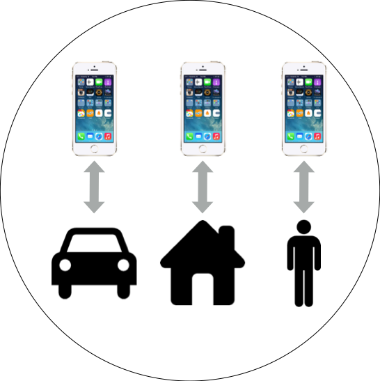
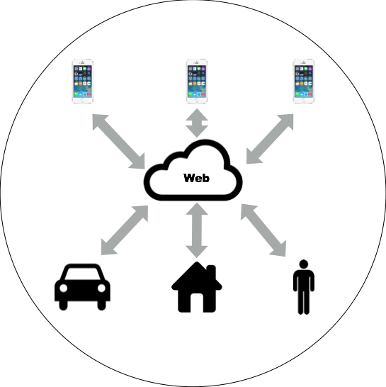

## HTTP 舊瓶新裝

在 Internet of Things（IoT）的技術發展藍圖裡，描述了 IoT 的 4 個發展階段，其中第 4 個階段就是 WoT。IoT 的第 4 個階段，聚焦在 Advanced Sensor Fusion 與 Physical-World Web 這二個技術層面上。

根據維基百科上的定義，WoT 是 IoT 的 Application Layer，並且是使用 Web 技術來打造 application。也就是說，IoT + Web-enabled technologies 就是 WoT。對 WoT 來說，最重要的觀念，就是以 URL 來表示 IoT 裝置；為 IoT 加入 URL 的觀念，就是 Google 提出的 Physical Web 計畫。

簡單來說，IoT 正在發生三件大事。

1. Going Web：物聯網正在與 Web 融合（IoT + the web）
2. Open IoT Cloud Architecture：如上，要與 Web 融合，就要發展一個使用相關開放標準的 IoT Cloud 架構
3. Physical Object：硬體裝置將與 REST 架構密切結合

這三件大事，其實是一個交互關係：要 Going Web 當然就要以 Web 標準來建立一個 Cloud 架構，要讓硬件與 Cloud 架構結合，就要讓硬件能以 URL 方式表示，或是能推送 Time-Series Data 到 Cloud。

這三件大事，其實說白了就是 HTTP。HTTP 並不是個新技術，也不是什麼困難的技術，與物聯網的交集，不過也就是舊瓶新裝。但難就難在舊瓶新裝，是個哲學思想提昇的過程：這需要一套整體的新思維。

從技術的角度來看，WoT 就是 IoT + the web 的架構，也就是讓物聯網透過 HTTP 來互連（interoperability）。而另一種物聯網的互連方式，就是 Machine-to-Machine（M2M）。這二種互連的做法，有不同的使用情境（Use Scenario），硬體的設計也有所不同。

如圖 14.1，這是 M2M 的使用情境。在這個情境中，裝置與裝置之間，透過 Bluetooth（BLE）與 Zeebig 
協定來溝通。例如，溫度感測裝置，透過 BLE 將數據傳送給手機。



圖 14.2 是 WoT 的使用情境。同樣是溫度感測裝置，在 WoT 情境中，裝置透過 HTTP、CoAP 或 WebSocket 協定，將數據傳送給伺服器（IoT Cloud），手機再經由伺服器取得數據。



WoT 延用現有的 Web 技術來建立整體架構，以下是 WoT 使用的 Web 相關技術：

* HTML5 與 CSS3－用來實作 WoT Appcalition（即 Web Frontend）
* JavaScript
* HTTP 1.1 與 HTTP 2.0 協定
* JSON 與 JSON-LD
* EXI 與 RDF
* CoAP 協定
* WebSocket 協定
* MQTT 協定
* OAuth
* REST 架構

目前，許多大廠與越來越多的新創公司，也開始提供 IoT over Web 的服務。廣義來說，這些服務都是屬於 Web of Things 的概念。

## Constrained Device

WoT 裝置的硬體範圍很廣，小至 Sensors 類型的硬體，大到伺服器等級的硬體。從運算能力的角度來區分，WoT 裝置的硬體範圍（scale）如下：

* 8-bit MCU 與 Wi-Fi Module
* 32-bit MCU（Cortex-M）
* Application Processors（Cortex-A）與 Network Processor（Atheros）
* Server Farms

8-bit MCU、Wi-Fi Module 與 32-bit MCU 都是硬體資源（處理器頻率、記憶體與、電力與儲存裝置）較受限的環境，這樣的物聯網裝置稱為 Constrained Device。因為硬體資源有限，一些針對 Constrained Device 的技術，就陸續被發展出來。例如，CoAP 協定就是專為 Constrained Device 所定義的標準。

目前流通性（使用程度）較高的幾個 Constrained Device 技術如下：

* CoAP
* MQTT
* 6LoWPAN
* LWM2M

在技術的選用上，會以是否為 Constrained Device 做為依據。例如，使用 Raspberry Pi 實作溫度感測器時，可以使用 WebSocket 與 HTTP 來傳送數據到 IoT Cloud。使用 ARM mbed 實作溫度感測器時，會考慮以 CoAP 為主。

另外，因為 MCU 技術的進度，有些 MCU 裝置的硬體資源並非如此受限，例如 Arch Pro（LPC1768）開發板，這是一款 ARM mbed 的開發板。Arch Pro 所採用的 NXP LPC1768 MCU（Cortex-M3）晶片，運算能力可達 100MHz。因此，如果處理的 TCP 連線處理不多，在 Arch Pro 上使用 WebSocket 協定時，並不會造成太多的硬體負擔。

因為 Cortext-M 技術上的進步，或許應該再將 MCU 裝置區分為 Constrained Devices 與 Less Constrained Devices 二類。有些不是專供 Constrained Devices 使用的技術，也可以運用在 Constrained Devices 上。

## Physical Object

首先，先談談 Physical Object。將 IoT 裝置以 REST API 來表示，這個 IoT 裝置就稱為 REST Device。如果更進一步以「對象」來封裝此觀念的話，也可以稱做 REST Object。例如：

```
http://wot.city/1/jollenchen/dust/kitchen
```

REST API 是一種 URI 的形式。所以，也可以這樣說：將 IoT 裝置以 URL 形式來表示；這就是 Google 的 Physical Web 計畫，所提出的觀念。

現在，只需要以 GET 方法（HTTP 協定）來調用這個 REST API，就能得到 IoT 裝置的數據。REST API 是一種表示「資源」的觀念，以上述的 REST API 來說：

* /1：代表 API 的版本號碼
* /1/jollenchen：代表這個裝置的對象名稱（Object name）
* /1/jollenchen/dust/kitchen：代表對象裡的屬性（Attributes），*dust/kitchen* 可視為 *dust.kitchen* 

從 REST 的角度來看，*jollenchen* 就是一個對象，這個對象只能存在一個，意思是名稱不能重覆。用設計模式的方式來解釋，就是 Singleton。

最後，設計者會賦與 *dust.kitchen* 一個意義：廚房的空氣感測數據。

REST Device 是一個實物，也就是硬件設備，因此也稱為 Physical Object。有了 Physical Object 做為基礎，要搭建 IoT 的 Cloud Architecture 並不是一件難事。

## IoT Open Architecture：HTTP & REST API

IoT 過去著重在 M2M 使用情境，現在則開始跨入 Machine to Web 的情境。這是 IoT 開始與 Web 融合的階段，產業圏把這個使用情境稱為 Web of Things（WoT）。WoT 之所以重要，在於它開始讓 Web 實體化。過去 Web 是虛擬化的物品，現在則是真正看得到，也摸得到的實體。

Google 把這樣的概念稱為 Physical Web，也就是用 URL 的方式，來表示所有的物聯網裝置。ARM 也有類似的生態系統，稱為 ARM mbed。ARM mbed 的主軸也是 WoT，這從 mbed OS 的幾個重要技術特色可以看出：ARM mbed 定位為 Full Stack OS，並且支援 HTTP、Websocket 與 CoAP 等重要協定。

現在我們知道，只要在 ARM mbed 裝置裡，實現一個輕量化的 Web 服務器，可以將 IoT 裝置「表示為 URL」。並且使用瀏覽器，來「讀取」裝置的感測數據。

使用 HTTP 與 REST 很容易實現 Physical Object 的設計哲學。但是，這樣的情境並不算最佳。

從數據模式的角度來說，這是「Data Pull」的設計模式；更好的使用情境，應該是「Data Push」。HTML5 的 Websocket 標準，自然被引用到 IoT Open Architecture 裡。ARM mbed 操作系統，也支持 Websocket。

## 從 HTTP 到 Websocket & CoAP

從 HTTP 的發展歷史來看，它是一個很成功的 Web Protocol。HTTP 自然是 Web 使用情境的協定。當 Web 進入到物聯網後，HTTP 也要做適度的裁切與調整，才會更適合 WoT 的使用情境。這個進化版的 HTTP 就是 CoAP。

不管是 HTTP 的使用情境，還是 Websocket 的使用情境，都可以用 ARM mbed 與 Arch Pro 開發板來實現。CoAP 當然也是。現在只有一個問題：IoT Cloud 服務。這就是 WoT.City 想要探討的問題：一個 IoT Open Architecture。

## 物聯網的真正關鍵：IoT Open Architecture

Intel 當然也在 WoT 的遊戲裡面。IBM 也沒有缺席，經由 Bluemix 與 IoT 基金會，IBM 也在 WoT 生態中開始卡位。幾個 big players 都在推展自已的 WoT 生態與 IoT Cloud 架構。然而，未來由這些 big players 所架構出來，並以 Web 為主幹的 IoT Architecture，真的能提昇生活品質，或促進社會進步嗎。

## Privacy

我們把未來的生活，完全交付給 Big players 來幫我們架構，這樣的未來 IoT 世界嗎，身為消費者的我們，難道一點都不緊張嗎。這些 big players 打造的也是使用開放標準，所構成的 Open Architecture，因此，我們還有必要發展自已的 IoT Open Architecture 嗎？

IoT Open Architecture 的關鍵，當然必須由開放標準組成，例如：HTTP、CoAP 等。在這個架構裡面的軟體程式碼，必須是以 Apache、MIT 或 BSD 授權的形式分享；MIT 與 BSD 授權的生態，在 Web 開發者社群裡存在已久，這部份也不會是問題。

回到 IoT 裝置的角度來看，系統程式的程式碼（例如：作業系統與程式庫），是否為開源形式，從整體的 IoT Open Architecture 來看，也完全沒有影響。一個真正開放的 IoT Architecture 要具備什麼因素呢？在這裡分享一個的看法：Personal Things。

從現有的 IoT 生態來看，像是健康照護或個人生理監測等，所收集的資料，都朝向「資料集中化儲存分析」的發展趨勢。然而，以個人生理資料來說，我們都是無償對這些「雲服務」的公司提供寶貴資料，這些公司對資料進行分析與價值挖掘後，所取得的商業利益，是否能有一個機制，能分享與回饋給當初提供寶貴「素材」的我們。

上述看法並不是要雲服務公司，完全將分析後的資訊公開或免費提供，而是應採用 Public Domains 的方式共享。例如，我們可以用一個合理的價格，取得部份分析方法的模型，或是參考數據。然而，現在我們無償提供資料，卻只能提到最後的分析結果。Public domains 是一種在共享與商業中，取得均衡發展的做法。

## Personal Things

消費者現在的認知，對物聯網公司採集並儲存個人生理資訊，似乎是「自然合理」。如果現在開始，能進行一些教育活動，相當大家很快就會有意識。上述的問題，就是為什麼需要一個 IoT Open Architecture 的理由之一。

如果將收集到的資料，儲存到一個非開放的 IoT 架構，是否能「取回」屬於自已的資料，會是一個問題。將自已收集的資料，儲存在一個真正開放的 IoT 架構，就能解決這樣的問題。這就是開放式 IoT 架構的意義，開放式架構並不是免費，也不是反商業化。開放式架構可以是收費服務，但「Personal Things」必須是：Free（自由）。

要實現 Personal Things 的理想，讓 IoT 不致朝向對個人不利的「中央化」方向發展，開放硬體（Open Hardware）也是很重要的環節。IoT 不能缺少硬體，但製造商現在視 IoT 硬體為「新市場」時，身為消費者的我們，又要成為這種集中製造生態的肥羊。

## Hackers x Makers

如同筆者在前一期的專欄中提到的，「物聯網裝置終將免費」。在 IoT Open Architecture 的理想中，消費者可以免費取得硬體。這個理想並非不可行，第一個步驟，就是設法降低取得硬體的成本。自造自已的硬體（成為 IoT 的創客），就是重要的啟步。

製造商的思維，會考慮的是研發、物料、製造、庫存、行銷等等各種成本，所以把「消費者付費購買」合理化，過去的消費影像也給我們這樣的知識，所以一切變的合理。IoT Open Architecture 不在於反抗這樣的商業模式，而是希望能有更環保的製造方法。

未來每個人身上都會有超過 10 個 IoT 裝置，因此全世界的 IoT 硬體總數，基本單位將成為「百億」計。過去的製造與銷售思維，是不斷的採集地球資源，然後不斷地生產新產品、不斷地銷售。這比過去十年的智能手機時代還可怕，這是一個未來會把所有地球資源，都做成硬體的概念。

IoT Open Architecture 如果能包含創客運動（Maker Movement）的成份，創客就會去重製、改裝、交換或重用硬體，所以可以改善這種不斷製造、不斷消耗資源的做法。IoT Open Architecture 不只是技術架構，也是一套內建自由授權的架構，也要包含創客運動。

## Openmbed and WoT.City

因此，筆者的想法是，打造 IoT Open Architecture 是全民運動；因此要有一套「範本」供大家使用。這套 IoT Open Architecture 範本除了希望做出一套 Full Stack 的 IoT Open Architecture 外，也必須是能包含所有周邊配套的 Full Landscape 開放架構。

WoT.City 就是一個這樣的計畫。本書除了介紹 IoT 如何結合雲端服務外，也將介紹 WoT.City 的使用方式與設計原理，讓大家也能架設「IoT 自有雲」。

## 本章小結

Web of Things 是一套使用 Web 技術打造 IoT + Cloud 的 Design Principles。要進入 Web of Things 開發領域，幾個入門的基本功是必備的：

* JavaScript 程式設計
* HTML5 標準與基本的 Frontend 製作
* Websocket Server 與 Client 實作
* Node.js 基礎
* REST 架構觀念
* NoSQL 資料庫基礎
* 使用 MVC 框架（例如：Backbone）

本書第 1 章到第 14 章，針對以上主題，做了一個基礎觀念的介紹，以及實作說明。特別是 Node.js 技術，將會直接影響到 Web of Things 的實作能力。